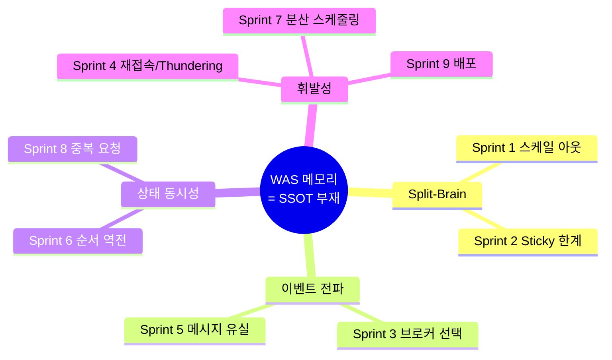

# Why Redis SSOT — Sprint 3 이전 토론 정리

Sprint 3 본격 진입 전 "왜 하필 Redis SSOT 인가"를 대안들과 비교해 정리한다. Sprint 1-2를 실제 구현 없이 문서로만 마무리한 배경이기도 하다.

## 메타 관찰: 시나리오 9개를 관통하는 단일 선택

> **WAS 메모리를 상태 저장소로 쓴다**

cs-troubleshoot의 모든 시나리오가 이 한 선택에서 파생된 증상들이다.

Sprint 3에서 Redis SSOT 도입하면 이후 시나리오들은 "Redis SSOT 위에 **어떤 패턴을 추가로 쌓을지**"의 연속으로 풀린다.

구체적으로 현재 baseline에 남아있는 `DelayedPlayerRemovalService`, `DelayedRoomRemovalService`는 "Redis TTL 주면 저절로 사라졌을 것"을 `ScheduledFuture + ConcurrentHashMap`으로 직접 구현한 결과다. WAS 재시작 = 타이머 소멸, multi-WAS에서 어느 WAS에 타이머가 걸릴지 비결정적이라는 **두 개의 숨은 폭탄**을 내장한 채 동작 중이다. Sprint 7 주제가 바로 이 패턴의 파괴.

---

## 대안 비교

### 옵션 A. WAS 메모리 + Redis Stream (Event Sourcing)

모든 상태 변경을 Stream에 이벤트로 기록, WAS는 부팅 시 재생해서 상태 복구.

**구조적 문제**

1. **Replay 비용**: 방 1000개 × 이벤트 1000개 = 100만 재생. 부팅 시간 선형 증가. 해결책 = 스냅샷 → 스냅샷 저장소 필요 → **결국 분산 저장소 재도입**.

2. **MAXLEN 모순**
   - 자르면 = 과거 이벤트 손실 = 복구 불가
   - 안 자르면 = 무한 증가
   - 배포 중 MAXLEN 초과 시 늦게 부팅한 WAS는 누락 구간을 영원히 못 봄.

3. **Stream의 본질 = 작업 큐**
   - Consumer Group은 작업 분배용, 상태 브로드캐스트용이 아님. 한 메시지는 그룹 내 한 컨슈머에만 전달.
   - 모든 WAS가 모든 상태 변화를 보려면 각 WAS를 별도 그룹으로 → **결국 Pub/Sub의 비효율 시뮬레이션**.

4. **일관성 시점 불명**: 부팅 중 WAS가 "복구 중"인지 "준비됨"인지 판단 어려움. Read-your-write 보장 안 됨.

**결론**: Event Sourcing은 audit/시간여행 디버깅이 본질 가치인 시스템(금융, 로그 분석)에 적합. ephemeral한 게임 룸엔 과한 복잡도.

### 옵션 B. MySQL SSOT

**강점 (사용자 직관 검증)**
- 100~300ms 주기, 룸 100개 × 5명 = 약 500 TPS는 InnoDB에게 여유.
- PK 단순 갱신은 ms 단위. 버퍼풀 히트 시 메모리 접근 수준.

**약점이 다른 데 있음**

| 측면 | MySQL | Redis |
|---|---|---|
| Latency | 5~10ms (fsync 포함) | 0.5~2ms |
| **Pub/Sub** | **없음** (binlog tailing / polling 필요) | 기본 제공 |
| TTL | 스케줄러 필요 | 키 단위 자동 |
| Connection | 스레드당, 수십~수백 한계 | multiplex, 수천 가능 |
| 원자성 | 락 (deadlock 가능성) | Lua single-thread (락 불필요) |
| 자료구조 | row/table | Hash/Set/Sorted Set — 게임 상태 그대로 |

**핵심 불일치**: MySQL을 SSOT로 써도 "WAS 간 실시간 이벤트 전파"는 불가능. 결국 MySQL + 별도 메시지 큐 조합 → 그 큐가 Redis라면 Redis가 SSOT까지 겸하는 게 단순.

### 옵션 C. Redis SSOT + Pub/Sub (선택)

하나의 인프라로 SSOT + 메시지 브로커 + TTL + 원자 연산 전부 제공.

**게임 워크로드 3조건과 적합도**

| 요구 | MySQL 비용 | Redis 비용 |
|---|---|---|
| 짧은 수명 (TTL) | 배치 스케줄러 구현 | 키 단위 설정 끝 |
| 고빈도 갱신 (100~300ms) | 락 관리 + deadlock 위험 | Lua single-thread 원자 |
| 크로스-WAS 이벤트 전파 | 부재 (별도 큐 필요) | Pub/Sub 내장 |

세 조건이 겹치는 워크로드에서 MySQL은 세 군데 다 추가 비용을 요구하고, Redis는 세 군데 다 네이티브로 제공한다. **엔지니어링 취향이 아니라 도구 적합성 문제.**

---

## 자주 나오는 오해 교정

### "WAS 늘면 모든 WAS가 모든 데이터를 메모리에 올려두니 OOM"

**잘못된 가정.** Redis SSOT 패턴에서:
- WAS는 요청 시점에 Redis에서 상태 읽음 (짧은 TTL 캐시 가능)
- WAS 메모리엔 방 데이터 상주 안 함 → WAS는 거의 stateless
- OOM 압박 없음. scale out 시 메모리 사용량 증가 안 함

### "그룹/파티션/리밸런싱 필요 — 정합성 깨질 수도"

**Kafka 멘탈 모델이 섞임.** Redis는 공유 저장소라 그룹/파티션/리밸런싱 개념이 기본적으로 없음. 모든 WAS가 같은 Redis를 봄.

**Redis Cluster는 진짜 병목일 때(수십만 TPS+) 고려**:
- 키 슬롯 분산. 키 단위 격리라 일반 정합성 영향 적음.
- multi-key Lua는 같은 슬롯이어야 함 → hash tag로 해결 (`{joinCode}:state`, `{joinCode}:players` 같이 묶음)
- Sharded Pub/Sub (Redis 7+) — 채널이 노드 분산

CoffeeShout 규모(룸 수백 개)에서는 단일 Redis 노드로 충분. Cluster 도입은 한참 뒤 얘기.

---

## 데이터 수명 기반 분리 (baseline에도 부분 적용됨)

| 종류 | 예시 | 저장소 |
|---|---|---|
| 영속 | 게임 결과, 대시보드 집계, 메뉴 | MySQL |
| 휘발 | 방 상태, ready 플래그, 플레이어 위치, 세션 매핑 | **Redis (Sprint 3 이후)** |

경계: "게임 종료 이벤트" 시점 → 결과 MySQL 기록 → Redis 상태는 TTL로 자동 정리.

Sprint 3가 하는 일 = **휘발 데이터의 "WAS 메모리" → "Redis"** 이전. 영속 데이터는 지금 구조 유지.

---

## 결론 한 문장

Redis는 "캐시"가 아니라 **"휘발 상태 전용 분산 공유 메모리 + 메시지 브로커 + 원자 연산기"**다. 이번 프로젝트 요구사항에 장갑처럼 맞는다.

SSOT 없는 분산은 **합의 없는 민주주의** — 각 WAS가 각자 진실을 주장하고, 그 조각들을 맞추려고 sticky, 스케줄러, 락, 재전송 방지 같은 패치를 끝없이 덧대게 된다. Redis SSOT 하나로 대부분 녹아 없어진다.

---

## 참조
- `_workspace/sprint_1/01_architect_design.md` — Split-Brain 재현 설계 (구현 skip)
- `_workspace/sprint_2/01_sticky_session_limits.md` — Sticky 한계 논증 (구현 skip)
- Sprint 3 설계 문서 (예정) — 본 인사이트를 motivation 섹션으로 흡수
