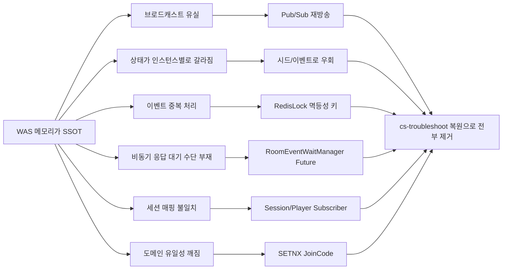

# 프로젝트에서 실제 발생했던 SSOT 부재 문제들

## 개요

단일 WAS 시절의 CoffeeShout는 게임 상태(Room, Player, Deck, ColorIndex, Session, JoinCode)를 전부 WAS 메모리에 들고 있었다. 스케일 아웃 이후에도 이 메모리 중심 구조를 유지한 채 분산 이슈가 드러날 때마다 **Redis Pub/Sub → Redisson Lock + 멱등성 키 → Redis Stream → Redis Stream + 비동기 I/O**로 패치를 덧대 왔다.

이 문서는 `archive/pre-cs-troubleshoot` 브랜치에 보존된 걷어낸 코드와, 당시 코드를 만들게 된 커밋들의 메시지/diff를 증거로 삼아 **실제로 발생했던 증상과 그 원인, 도입된 패치, 현재 baseline에서의 상태, cs-troubleshoot Sprint 매핑**을 정리한다. 사례는 전부 이 프로젝트에 실재했던 것이며, 일반론은 배제한다.

현재(main) baseline은 `9a87a1b refactor: cs-troubleshoot baseline 복원` 커밋에서 분산 패치를 전부 걷어낸 상태이다. `RedisConfig`, `RedissonConfig`, `RedisLockAspect`, 9개의 Publisher/Subscriber, 7개의 Stream Producer/Consumer, `RoomEventWaitManager`, `RedisJoinCodeRepository`, Graceful Shutdown 보호로직이 제거되었다.

## 문제 인덱스

| # | 증상 | 도입된 패치 | 증거 | 근본 원인 | Sprint 매핑 |
|---|---|---|---|---|---|
| 1 | 다른 WAS에 붙은 같은 방 유저에게 이벤트가 전달되지 않음 | Redis Pub/Sub `RoomEventSubscriber` + `BroadcastEvent` | 커밋 `6d2e6f6` [feat] Redis pub/sub Event First 아키텍처 적용 (#700) | 브로드캐스트 대상 세션이 로컬 WAS에만 존재 | Sprint 1/3 |
| 2 | 분산환경에서 CardGame deck이 WAS마다 다르게 셔플됨 | JoinCode 기반 seed로 Random 고정 | 커밋 `350a043` [fix] 분산환경에서 cardgame의 deck 동기화 수정 (#781) | Deck 자체를 각 WAS 메모리에 들고 있어서 원본이 여러 개 | Sprint 4/5 |
| 3 | 분산환경에서 player의 colorIndex가 WAS마다 다르게 할당됨 | `MemoryColorUsage` → `joinCode` 기반 ColorUsage 통합 후 궁극적으로 필드 제거 | 커밋 `024fb13` `03850e5` | WAS 메모리별 HashMap이 정답을 따로 가짐 | Sprint 4 |
| 4 | 룰렛 Spin 결과가 인스턴스마다 Winner가 다르게 나옴 | `RouletteSpinEvent`에 Winner 데이터를 싣고 Pub/Sub으로 방송 | 커밋 `6d2e6f6` 중 "모든 인스턴스에서 동일한 Winner 보이도록 수정" | 룰렛 추첨 로직을 각 인스턴스가 독립 실행 | Sprint 4 |
| 5 | Pub/Sub 이벤트를 모든 인스턴스가 수신 → 같은 이벤트가 N번 처리 | `@RedisLock` + `donePrefix` 멱등성 키 | `archive/pre-cs-troubleshoot:.../global/lock/RedisLockAspect.java:46-80` / 커밋 `7f47e14` | Pub/Sub fan-out + at-least-once, 처리 책임 분산 필요 | Sprint 6 |
| 6 | 방 입장 요청 응답이 비동기 이벤트 뒤에 와야 하는데 동기 리턴 구조였음 → 간헐적 방 참가 실패 | `RoomEventWaitManager` + `CompletableFuture` | `archive:.../room/infra/messaging/RoomEventWaitManager.java` / 커밋 `03850e5` [fix] 간헐적으로 방 참가 안되던 문제 해결 (#789) | Redis Pub/Sub은 fire-and-forget — 처리 완료 신호가 없어서 요청 스레드가 뭘 기다려야 할지 모름 | Sprint 3/6 |
| 7 | 세션/플레이어 매핑이 WAS별로 따로 존재 → 다른 WAS의 Disconnect 이벤트를 모름 | `PlayerEventSubscriber` + `SessionEventSubscriber`로 모든 인스턴스에 방송 | `archive:.../global/websocket/infra/PlayerEventSubscriber.java` / 커밋 `6d2e6f6` 후반부 | `StompSessionManager`의 `ConcurrentHashMap`이 로컬 WAS 메모리 | Sprint 7 |
| 8 | Disconnect 시 플레이어를 바로 지우면 앱 전환/일시적 네트워크 끊김에서 방이 소멸 | `DelayedPlayerRemovalService`로 15초 지연 후 삭제 + 재연결 시 취소 | 커밋 `4efcf8d` / `backend/src/main/java/coffeeshout/global/websocket/DelayedPlayerRemovalService.java:17-62` | 재연결을 같은 WAS로 받을 보장이 없고, 상태 복구 수단이 없음 | Sprint 8 |
| 9 | Redis Pub/Sub 기반 비동기 처리에서 순서/유실 이슈 → Stream으로 교체 | Redis Stream Producer/Consumer | 커밋 `c9c908e` [feat] Redis Stream 도입 (#730) 중 "batchSize를 1로 설정하여 동시성 문제 해결" | Pub/Sub은 순서/유실 보장이 없어 카드선택/방입장 같은 커맨드에 부적합 | Sprint 6 |
| 10 | Redis Stream XADD가 Inbound 스레드를 블로킹 → Inbound p95 201ms, 큐 톱니 적체 | `RedisTemplate` → Lettuce Async Non-blocking API | `backend/docs/Inbound Optimization/redis-stream-performance-optimization.md` / 커밋 `c8868e4` 외 | Inbound 경로 중간에 동기 I/O가 끼어 스레드가 Redis 응답을 전부 대기 | Sprint 6 후속 최적화 |
| 11 | JoinCode가 단일 WAS ConcurrentMap에 저장되어 인스턴스 간 중복 생성 가능 | `RedisJoinCodeRepository`가 `SETNX`로 원자적 중복 방지 | `archive:.../room/infra/RedisJoinCodeRepository.java:19-27` | 코드 생성 경합을 로컬 맵으로는 막을 수 없음 | Sprint 4 |
| 12 | MiniGame 결과 저장이 각 인스턴스에서 동시에 실행 → DB에 중복 INSERT | `MiniGameResultSaveEventListener`에 `@RedisLock(doneKey)` 적용 | `archive:.../minigame/event/MiniGameResultSaveEventListener.java:38-46` / 커밋 `7f47e14` | @EventListener가 모든 인스턴스에서 1회씩 실행, JPA로 그대로 흘러감 | Sprint 6 |

카테고리 분포: 크로스 인스턴스 브로드캐스트 4건(#1, #4, #7, #11), 상태 동기화 2건(#2, #3), 동시성·멱등성 3건(#5, #9, #12), 비동기 응답 1건(#6), 스케줄러·세션 1건(#8), 인프라 최적화 1건(#10).

## 상세 사례

### 1. 다른 WAS에 붙은 같은 방 유저에게 WebSocket 브로드캐스트가 가지 않음

**발견 증거**
- 커밋 `6d2e6f6 [feat] Redis pub/sub Event First 아키텍처 적용 (#700)` 본문 중: `"BroadcastEventPublisher 클래스에서 브로드캐스트 이벤트 발행 로직 구현", "Redis Pub/Sub 기반 이벤트 구독 및 처리 로직 구현"`.
- `archive/pre-cs-troubleshoot:backend/src/main/java/coffeeshout/room/infra/messaging/RoomEventSubscriber.java:31-74`에서 `RedisMessageListenerContainer`가 모든 RoomEvent를 받아 `RoomEventHandler`로 넘김.
- `backend/docs/rdd/scenario.md` 시나리오 1에 동일 증상이 그대로 서술됨 ("유저A의 베팅이 같은 WAS에 연결된 유저에게만 전달된다").

**프로젝트가 도입했던 해결책**
`RoomEventPublisher`가 이벤트를 Redis Pub/Sub 채널로 발행하고, 전 인스턴스의 `RoomEventSubscriber`가 `RoomEventHandlerFactory.getHandler(eventType)`로 로컬 WebSocket 브로커에 재브로드캐스트. 초기 별도 `BroadcastEvent` 계층이 있었으나 후반부 `RoomEvent`로 통합되었다(`6d2e6f6` 커밋 메시지의 "refactor: 브로드캐스트 이벤트 관련 코드 삭제 및 RoomEvent로 통합" 참조).

**왜 이게 필요했나 (근본 원인)**
WebSocket 세션은 STOMP 서버 로컬에만 매핑된다. `SimpMessagingTemplate.convertAndSend()`는 이 WAS가 아는 세션으로만 메시지를 쏜다. 방 상태(Player 리스트, Ready 상태, MiniGame 선택) 자체도 WAS 메모리의 `Room` 객체에 있어, 이벤트를 받지 못한 WAS는 그냥 상태 변경을 모른다.

**현재 상태**
baseline에서 `RoomEventPublisher/Subscriber` 파일 전부 삭제, `RoomEventDispatcher`(Spring `ApplicationEventPublisher` 기반 로컬 디스패처)로 대체됨. 단일 WAS 전제 복구. 커밋 `9a87a1b` diff 참조.

**Sprint N과의 연결**
Sprint 1(스케일 아웃)에서 문제를 체험, Sprint 3(브로커 선택)에서 Pub/Sub 대신 **Redis를 SSOT로 두고 상태 변경 알림만 Pub/Sub으로 쏘는** 방향으로 재설계. 이벤트가 곧 상태가 아니라 "Redis를 읽어라" 신호가 된다.

---

### 2. 분산환경에서 CardGame deck이 WAS마다 다르게 셔플됨

**발견 증거**
- 커밋 `350a043 [fix] 분산환경에서 cardgame의 deck 동기화 수정 (#781)` 메시지: `"모든 인스턴스에서 동일한 카드 순서를 보장하도록 시드 기반 Deck 셔플 로직 구현", "MiniGameType에서 joinCode로부터 시드를 생성하여 일관된 게임 상태 보장"`.

**프로젝트가 도입했던 해결책**
`CardGame`, `MultiplierCards`, `AdditionCards`에 `Random` 인스턴스를 생성자 주입. `MiniGameType`에서 `Integer.toUnsignedLong(joinCode.hashCode())`로 시드를 만들어 주입. 같은 joinCode면 어느 WAS에서든 같은 셔플 결과.

**왜 이게 필요했나 (근본 원인)**
`Deck.shuffle()`을 WAS마다 각자 실행하는데 난수가 달라 결과가 달라졌다. 문제의 본질은 **Deck 객체가 WAS 메모리에 각자 있고, Pub/Sub 이벤트로 "카드 선택"만 방송**했기 때문이다. 다른 WAS는 원본 Deck을 가져올 곳이 없어 자기 버전을 계속 쓴다. 시드 고정은 "원본을 공유하는 대신 결정론적으로 동일하게 재구성하자"는 우회책이다.

**현재 상태**
baseline에 그대로 남아 있음(`joinCode` 기반 seed 방식). 단일 WAS에서는 사실상 의미가 없는데 유지만 되어 있다.

**Sprint N과의 연결**
Sprint 4/5에서 Deck 자체를 Redis 자료구조(Hash/List)로 올리면 "원본 하나"가 생겨 시드 트릭이 불필요해진다. 시드 기반 해결책이 **SSOT 부재를 우회한 임시방편**이라는 모범 사례.

---

### 3. 분산환경에서 player의 colorIndex가 WAS마다 다르게 할당됨

**발견 증거**
- 커밋 `024fb13 [fix] 분산환경에서 player의 colorIndex 동기화 수정 (#780)`: `"ColorUsage를 MemoryColorUsage 저장소로 분리"`, 후속으로 `"HashMap을 ConcurrentHashMap으로 변경하여 동시성 문제 해결"`.
- 9일 뒤 커밋 `03850e5 [fix] 간헐적으로 방 참가 안되던 문제 해결 (#789)`에서 `"MemoryColorUsage 클래스 및 관련 메서드 삭제", "Players 초기화 시 joinCode 전달 및 ColorUsage 생성자에 joinCode 추가"`로 번복.

**프로젝트가 도입했던 해결책**
1차: `MemoryColorUsage`(ConcurrentHashMap) 도입 → 여전히 WAS 로컬이라 해결 안 됨.
2차: `Player.colorIndex` 필드 자체 제거, Room 내부의 Players가 joinCode 스코프로 ColorUsage를 관리하도록 단순화.

**왜 이게 필요했나 (근본 원인)**
ColorUsage가 `static` 또는 싱글턴 Map이었을 때, WAS 2개에서 같은 방의 플레이어가 서로 다른 인스턴스에 접속하면 각자 0번 색깔부터 할당한다. Room이 WAS 메모리에 있고 Pub/Sub으로 "플레이어 업데이트"만 방송하는 구조에선 색깔 상태 자체가 양쪽에서 독립적으로 진화한다.

**현재 상태**
2차 수정 반영된 상태로 baseline에 남음. colorIndex 필드는 제거됨.

**Sprint N과의 연결**
Sprint 4 — "방 상태의 SSOT는 어디인가" 논증. Redis Hash로 방/플레이어 상태를 올리면 색깔 할당도 원자적(`HSETNX` 등)으로 해결된다.

---

### 4. 룰렛 Spin 결과가 인스턴스마다 Winner가 다르게 나옴

**발견 증거**
- 커밋 `6d2e6f6` 본문 중: `"refactor: 모든 인스턴스에서 동일한 Winner 보이도록 수정", "spinRouletteInternal 메서드 제거 및 관련 로직 통합", "RouletteSpinEvent에 Winner 데이터 추가하여 이벤트 처리 간소화"`.

**프로젝트가 도입했던 해결책**
룰렛 추첨을 **발행자 한 인스턴스**에서만 수행하고, 결과(Winner)를 `RouletteSpinEvent`에 실어 Pub/Sub으로 방송. 구독자는 추첨을 다시 돌리지 않고 이벤트에 담긴 Winner를 그대로 사용.

**왜 이게 필요했나 (근본 원인)**
`spinRoulette` 로직이 `Random`을 써서 `Player` 리스트 중 확률 기반 추첨을 하는데, 구독자마다 각자 돌리면 결과가 다르다. 사례 2/3과 같은 "각자 계산 금지, 한 곳에서 결정하고 나머지는 따라간다" 패턴.

**현재 상태**
이벤트에 Winner를 싣는 구조는 `9a87a1b`에서 단일 WAS 구조로 돌아가면서 단순화됐으나, `RouletteSpinEvent` 자체는 `RoomEventDispatcher`가 쓰는 형태로 남음.

**Sprint N과의 연결**
Sprint 4 — 게임 결과의 결정권이 누구에게 있는지. Redis에 `SET NX`로 winner를 기록하는 방식이 더 단순하며, "이미 당첨자가 있으면 내 값을 버려라"가 자연스럽게 성립.

---

### 5. Pub/Sub 이벤트를 모든 인스턴스가 수신 → 같은 이벤트가 N번 처리됨

**발견 증거**
- `archive/pre-cs-troubleshoot:backend/src/main/java/coffeeshout/global/lock/RedisLockAspect.java:46-80`:
  ```java
  // 이미 처리된 이벤트인지 확인
  if (isAlreadyProcessed(doneKey)) {
      log.debug("이미 처리된 이벤트 (스킵): doneKey={}", doneKey);
      return null;
  }
  ```
- `archive:.../minigame/event/MiniGameResultSaveEventListener.java:38-46`에서 `@RedisLock(key = "#event.eventId()", lockPrefix = "minigame:result:lock:", donePrefix = "minigame:result:done:", waitTime = 0, leaseTime = 5000, doneTtl = 600000)`.
- 커밋 `7f47e14 fix: Redis Rock이 적용되지 않던 문제 해결`에서 `saveGameEntities(String joinCode, ...)` → `saveGameEntities(StartMiniGameCommandEvent event, ...)`로 시그니처 변경. SpEL `#event.eventId()`가 작동하려면 파라미터가 이벤트 객체여야 함.

**프로젝트가 도입했던 해결책**
`@RedisLock` AOP가 이벤트별로 세 가지를 동시에 처리:
1. Redisson `tryLock(0, 5000ms)`으로 첫 수신자만 실행.
2. 처리 완료 시 `done:<eventId>` 키를 TTL 10분으로 설정.
3. 다음 수신자는 `doneKey` 존재 확인 후 즉시 리턴(멱등성).

**왜 이게 필요했나 (근본 원인)**
Redis Pub/Sub는 구독자 전원에게 동일 메시지를 뿌린다. `MiniGameResultSaveEventListener.@EventListener`가 모든 인스턴스에서 1회씩 실행되면 MiniGame 결과 DB INSERT가 N번 일어나 중복 레코드가 생긴다. 발행자-구독자 모델과 "처리는 한 번만" 요구사항의 충돌.

**현재 상태**
`RedisLockAspect`, `@RedisLock`, `@RedisLock` 적용된 `MiniGamePersistenceService.saveGameEntities`, `MiniGameResultSaveEventListener` 내 어노테이션 전부 제거(`9a87a1b` diff).

**Sprint N과의 연결**
Sprint 6 — 멱등성 키 패턴. Stream 컨슈머 그룹을 쓰면 그룹 내 한 컨슈머만 메시지를 받으므로 `donePrefix`가 불필요해진다. **"그래서 왜 Pub/Sub에선 Lock이 필요하고 Stream에선 필요 없는가"** 의 레퍼런스 사례.

---

### 6. 방 입장 요청이 비동기 이벤트 처리 완료를 기다리지 못해 간헐적으로 실패

**발견 증거**
- `archive:.../room/infra/messaging/RoomEventWaitManager.java:11-66`:
  ```java
  private final ConcurrentHashMap<String, CompletableFuture<?>> pendingEvents = new ConcurrentHashMap<>();

  public <T> CompletableFuture<T> registerWait(String eventId) { ... }
  public <T> void notifySuccess(String eventId, T result) { ... }
  public void notifyFailure(String eventId, Throwable throwable) { ... }
  ```
- 커밋 `6d2e6f6` 중: `"RoomEventWaitManager에 cleanup 메서드 신규 추가로 불완전 이벤트 정리 로직 구현"`.
- 커밋 `03850e5 [fix] 간헐적으로 방 참가 안되던 문제 해결 (#789)`이 ColorUsage 동기화 변경과 묶여 해결됨.

**프로젝트가 도입했던 해결책**
1. REST `POST /rooms/enter` 요청 시 `RoomService.enterRoomAsync`가 `eventId`를 발급, `RoomEventWaitManager.registerWait(eventId)`로 `CompletableFuture` 등록.
2. `RoomJoinEvent`를 Pub/Sub/Stream으로 발행.
3. 담당 인스턴스가 처리 완료 후 `notifySuccess(eventId, room)` 호출.
4. 발행한 인스턴스의 `CompletableFuture.get()`이 깨어나 REST 응답 반환.
5. 커밋 `9a87a1b`에서 `RoomRestController.enterRoom`의 리턴을 `CompletableFuture` → 동기로 돌렸다는 언급.

**왜 이게 필요했나 (근본 원인)**
Pub/Sub은 "던지고 끝"이다. REST 입장 요청을 처리하는 스레드는 입장 처리 **결과**(성공/실패, 색깔 할당 결과 등)를 기다려야 응답을 만들 수 있는데, Pub/Sub에는 응답 채널이 없다. 로컬 `CompletableFuture`를 발행 측에 등록하고, 처리 측이 끝낸 뒤 "같은 인스턴스"에 알림을 보내는 가정으로 해결했다. **그러나 처리 측이 다른 인스턴스라면 `notifySuccess`를 못 찾는다** — 그래서 `pendingEvents.get(eventId) == null` 로그가 자주 찍혔고 이게 "간헐적 방 참가 실패"의 일부였다.

**현재 상태**
`RoomEventWaitManager.java` 삭제, `RoomRestController.enterRoom`이 동기 호출로 복원.

**Sprint N과의 연결**
Sprint 3/6 — Pub/Sub는 알림 채널, Redis SSOT는 결과 저장소라는 역할 분리. 입장 성공/실패가 Redis 상태로 즉시 읽히면 `CompletableFuture` 수작업 매니저가 사라진다.

---

### 7. 세션/플레이어 매핑이 WAS별로 분리되어 크로스 인스턴스 Disconnect를 모름

**발견 증거**
- `backend/src/main/java/coffeeshout/global/websocket/StompSessionManager.java:22-24`:
  ```java
  private final ConcurrentHashMap<String, String> playerSessionMap; // "joinCode:playerName" -> sessionId
  private final ConcurrentHashMap<String, String> sessionPlayerMap; // sessionId -> "joinCode:playerName"
  ```
- `archive:.../global/websocket/infra/SessionEventSubscriber.java:25-56`, `PlayerEventSubscriber.java:25-60`: Redis Pub/Sub으로 세션 등록/해제, 플레이어 연결/재연결 이벤트를 모든 인스턴스가 수신하여 로컬 맵을 동기화.
- `StompSessionManager.registerPlayerSessionInternal` 메서드 이름의 `Internal` 접미사는 Redis 이벤트 핸들러 전용(즉, 다른 WAS의 변경을 내 맵에 반영하기 위한 경로)임을 명시.

**프로젝트가 도입했던 해결책**
`SessionEventPublisher`/`PlayerEventPublisher`가 매핑 변경을 채널에 발행 → 모든 인스턴스 Subscriber가 `registerPlayerSessionInternal`/`removePlayerSessionInternal` 호출 → 모든 WAS의 `StompSessionManager` 맵이 결국 수렴(eventual consistency).

**왜 이게 필요했나 (근본 원인)**
`StompSessionManager`는 "어느 sessionId가 어느 playerKey에 묶여 있는가"를 WAS 로컬 `ConcurrentHashMap`으로만 알고 있다. WAS-A에서 Disconnect된 세션을 WAS-B는 모르기 때문에, 같은 방의 다른 플레이어에게 탈주 알림이 가지 않거나(WAS-B가 여전히 ready로 취급), 지연 삭제 스케줄이 WAS-A에서만 걸렸다가 WAS-A가 죽으면 스케줄이 통째로 날아가는 문제가 생긴다.

**현재 상태**
Pub/Sub 동기화 레이어 전부 삭제. `StompSessionManager`는 로컬 맵으로만 동작(baseline은 단일 WAS 전제).

**Sprint N과의 연결**
Sprint 7 — 세션 매핑을 Redis Hash로 올리면 `ConcurrentHashMap`이 SSOT를 대체한다. 인스턴스별 동기화가 필요 없어져 `SessionEventSubscriber` 자체가 사라진다.

---

### 8. Disconnect 즉시 삭제하면 앱 전환/짧은 네트워크 이슈에 방이 소멸함

**발견 증거**
- 커밋 `4efcf8d [feat] player의 Disconnect 감지 시, 15초 뒤에 삭제되는 로직 구현 (#547)`.
- `backend/src/main/java/coffeeshout/global/websocket/DelayedPlayerRemovalService.java:17`:
  ```java
  private static final Duration REMOVAL_DELAY = Duration.ofSeconds(15);
  ```
- 같은 파일 `schedulePlayerRemoval(String playerKey, ...)`에서 TaskScheduler로 15초 뒤 실행을 예약하고, 재연결 시 `cancelScheduledRemoval`로 취소.
- 커밋 `c9c908e` 후반부 "DelayedPlayerRemovalService에서 SessionEventPublisher 제거 및 StompSessionManager로 변경"에서 이 서비스와 Pub/Sub 동기화의 연계도 확인.

**프로젝트가 도입했던 해결책**
WebSocket Disconnect 이벤트 수신 즉시 삭제하지 않고 15초 지연. 해당 기간 안에 같은 playerKey로 Connect가 들어오면 `cancelScheduledRemoval`로 삭제 취소. Ready 상태는 즉시 false로 내림(`PlayerDisconnectionService.cancelReady`).

**왜 이게 필요했나 (근본 원인)**
모바일 환경에서 앱 백그라운드 전환, Wi-Fi 스위칭, 짧은 네트워크 끊김이 흔하다. 상태가 WAS 메모리에만 있으므로 "Room에서 Player 제거"가 실행되면 되돌릴 방법이 없다(이벤트 리플레이도 상태 복구 도구가 아님). **지연 삭제는 상태 SSOT가 메모리라서 "상태 삭제를 조심스럽게 해야 한다"는 약점을 TaskScheduler로 메운 것**이다.

**현재 상태**
`DelayedPlayerRemovalService`는 baseline에 그대로 남아 있음. `ScheduledFuture`는 WAS 로컬이라 WAS가 죽으면 예약도 증발한다는 구조적 한계도 여전.

**Sprint N과의 연결**
Sprint 8 — Player 상태를 Redis에 두고 TTL(예: 15초)로 자동 만료시키면 스케줄러 자체가 불필요하다. 재연결이 들어오면 TTL을 연장한다. WAS가 죽어도 TTL은 Redis에서 계속 카운트다운되므로 스케줄 유실이 사라진다.

---

### 9. Pub/Sub의 순서/유실 문제 → Redis Stream으로 교체

**발견 증거**
- 커밋 `c9c908e [feat] Redis Stream 도입 (#730)` 본문 중: `"batchSize를 1로 설정하여 동시성 문제 해결"`, `"refactor: 순서보장 쓰레드 크기 변경"`, `"refactor: Stream 분리"`.
- `archive:.../room/infra/messaging/RoomEnterStreamConsumer.java:48-54`:
  ```java
  cardSelectStreamContainer.receive(
      StreamOffset.fromStart(redisStreamProperties.cardGameSelectKey()),
      this
  );
  ```
- `archive:.../cardgame/.../CardSelectStreamConsumer.java`, `archive:.../racinggame/.../RacingGameStreamConsumer.java` 모두 Stream 기반.

**프로젝트가 도입했던 해결책**
방 입장(`RoomEnterStream`), 카드 선택(`CardSelectStream`), 레이싱 게임 탭(`RacingGameStream`)을 Pub/Sub 대신 Redis Stream으로 전환. `fromStart` 또는 consumer group으로 유실 방지, `batchSize=1` + 스레드풀 제한으로 순서 보장.

**왜 이게 필요했나 (근본 원인)**
카드 선택과 방 입장은 **커맨드**이다. 유실되면 "내 카드가 안 보임", 순서가 바뀌면 "내가 먼저 낸 건데 뒤에 낸 사람으로 처리됨"이 된다. Pub/Sub은 둘 다 보장하지 않는다. Stream은 메시지를 스토리지에 보관하고 ACK 기반으로 작동.

**현재 상태**
`RoomEnterStreamProducer/Consumer`, `CardSelectStreamProducer/Consumer`, `RacingGameStreamProducer/Consumer`, `RedisStreamProperties`, `RedisStreamInitializer` 모두 삭제. `SelectCardCommandHandler`, `StartMiniGameCommandHandler`가 서비스 직접 호출로 인라인됨(`9a87a1b` diff).

**Sprint N과의 연결**
Sprint 6 — 상태 SSOT가 Redis면 "유실"의 의미가 달라진다. Stream은 **커맨드 직렬화** 용도로 남을 수 있으나, 상태 복원 수단이 아니라는 점에서 의존도가 크게 줄어든다(`backend/docs/rdd/scenario.md` 시나리오 3의 의사결정과 일치).

---

### 10. Redis Stream XADD의 동기 I/O가 Inbound 스레드를 묶어 p95 201ms

**발견 증거**
- `backend/docs/Inbound Optimization/redis-stream-performance-optimization.md`:

  | 메트릭 | Inbound | Outbound |
  |--------|---------|----------|
  | **p95** | **201ms** | 10.5ms |

  > "Spring Data Redis의 `RedisTemplate`은 내부적으로 Lettuce의 동기 API(`sync()`)를 사용한다. Lettuce의 `sync()` API는 내부적으로 `async().get()`을 호출하여 호출 스레드를 블로킹한다."

- 같은 문서 6장: Non-blocking 전환 후 `p95 62.9ms, avg 24.1ms, Queue Max 85`로 개선. 커밋 `c8868e4`, `c79bd14`, `f065d17`, `22eece9` (redis stream 비동기 처리 시리즈).

**프로젝트가 도입했던 해결책**
`RedisTemplate.opsForStream().add()`를 Lettuce 네이티브 `asyncCommands.xadd(...).whenComplete(...)`로 교체. Inbound 스레드는 즉시 반환되고 Netty EventLoop가 실제 I/O를 담당.

**왜 이게 필요했나 (근본 원인)**
Stream을 도입하면서 **모든 WebSocket Inbound 메시지가 XADD를 1회 호출**하는 구조가 됐다. 스레드 32개를 올려도 전부 Redis 응답 대기에 빠져 큐가 0 ↔ 236 톱니 패턴을 그렸다. t4g.small vCPU 2에서 Load Average 326%. 기본 원인은 "상태 변경을 전부 외부 메시지로 옮기니 I/O가 Inbound 경로에 끼어든 것".

**현재 상태**
`9a87a1b`에서 Stream 제거와 함께 이 최적화 경로도 사라짐. 단, 문서는 보존되어 다음 Redis 도입 시 교훈으로 활용 가능.

**Sprint N과의 연결**
Sprint 6 후속 최적화 — Redis 경로를 도입할 때 "Inbound에 동기 I/O를 끼우지 말 것"이 체크리스트가 된다. SSOT를 Redis로 옮기더라도 Inbound 스레드가 직접 블로킹 호출을 하면 같은 증상이 재현된다.

---

### 11. JoinCode 중복 생성 가능성 — 로컬 Map으론 막을 수 없음

**발견 증거**
- `archive:.../room/infra/RedisJoinCodeRepository.java:19-27`:
  ```java
  @Override
  public boolean save(JoinCode joinCode) {
      final String key = JOIN_CODE_KEY_PREFIX + joinCode.getValue();
      // SETNX 명령어로 원자적으로 저장 (키가 없을 때만 저장)
      Boolean success = redisTemplate.opsForValue().setIfAbsent(key, "1", ttl);
      return Boolean.TRUE.equals(success);
  }
  ```
- `9a87a1b` diff에서 `RedisJoinCodeRepository.java` 삭제 + `MemoryJoinCodeRepository.java` 신규 32줄 추가.

**프로젝트가 도입했던 해결책**
JoinCode 생성 시 Redis `SETNX + TTL`로 원자적 중복 체크. 같은 코드가 동시에 두 인스턴스에서 발급되더라도 Redis가 한쪽만 승인.

**왜 이게 필요했나 (근본 원인)**
WAS-A의 `ConcurrentHashMap.putIfAbsent`는 WAS-A 안에서만 원자적이다. WAS-A, WAS-B가 동시에 같은 6자리 코드를 랜덤 생성하면 둘 다 `putIfAbsent`가 성공해 중복이 발생한다. 도메인 불변조건("joinCode는 전역 유일")이 단일 WAS 가정 위에서만 성립했다.

**현재 상태**
baseline에서 `MemoryJoinCodeRepository`(`ConcurrentHashMap + TTL` 직접 구현)로 단일 WAS 전제 복구.

**Sprint N과의 연결**
Sprint 4 — "도메인 불변조건을 지키는 원자적 연산 공간이 필요하다"의 최소 사례. Redis의 `SETNX`/Lua 스크립트가 자연스러운 해답.

---

### 12. MiniGame 결과가 모든 인스턴스에서 각자 저장되어 DB 중복 INSERT

**발견 증거**
- `archive:.../minigame/event/MiniGameResultSaveEventListener.java:30-46`:
  ```java
  @EventListener
  @Transactional
  @RedisLock(
          key = "#event.eventId()",
          lockPrefix = "minigame:result:lock:",
          donePrefix = "minigame:result:done:",
          waitTime = 0,
          leaseTime = 5000
  )
  public void handle(MiniGameFinishedEvent event) { ... }
  ```
- 커밋 `7f47e14 fix: Redis Rock이 적용되지 않던 문제 해결`: `saveGameEntities(String joinCode, ...)` → `saveGameEntities(StartMiniGameCommandEvent event, ...)`. SpEL `#event.eventId()`가 작동하려면 이벤트 객체가 직접 파라미터로 와야 하는데, 원래 `joinCode` 문자열만 넘겨 Lock이 **문자열 "joinCode" 이름을 못 찾아 null 키로 생성되거나 아예 적용이 되지 않았던 상황**을 고친 것.

**프로젝트가 도입했던 해결책**
사례 5와 동일한 `@RedisLock` + `donePrefix` 멱등성 키 패턴을 DB 저장 리스너에도 적용. `MiniGameResultEntity`의 중복 INSERT, `MiniGameEntity` 중복 생성을 방지.

**왜 이게 필요했나 (근본 원인)**
`@EventListener`가 인스턴스마다 1회씩 트리거되는데 그 안에서 JPA save를 호출하므로, 같은 eventId에 대해 WAS 수만큼 row가 생성된다. DB 레벨의 유니크 제약이 없는 컬럼(예: `rank`, `score`)이어서 조용히 중복 저장이 쌓였다.

**현재 상태**
`MiniGameResultSaveEventListener`에서 `@RedisLock` 제거, `MiniGamePersistenceService.saveGameEntities`에서도 `@RedisLock` 제거(`9a87a1b` diff). 단일 WAS 전제 복구.

**Sprint N과의 연결**
Sprint 6 — Stream 컨슈머 그룹이 있으면 그룹 내 단일 컨슈머만 이벤트를 받아 자연스레 1회 실행. 멱등성 Lock은 "Pub/Sub으로 방송한 걸 받은 뒤 스스로 중복 제거"라는 구조의 산물이며, 근본 해결이 아닌 방어막이다.

---

## 공통 패턴 정리



12개 사례 모두 "상태의 원본이 WAS 메모리에 있다"라는 단일 원인에서 파생됐다. 각 패치는 개별 증상을 막았지만 코드베이스 전체를 **이벤트 재방송 + 멱등성 + 대기 매니저 + 동기화 Subscriber** 조합으로 부풀렸고, 결과적으로 `9a87a1b`에서 한 번에 걷어내는 결정으로 이어졌다.

Sprint 3에서 Redis를 SSOT로 도입할 때 이 12개 사례는 "Redis 하나를 세우면 이 보상 로직 N개가 동시에 사라진다"는 동기의 근거가 된다.
