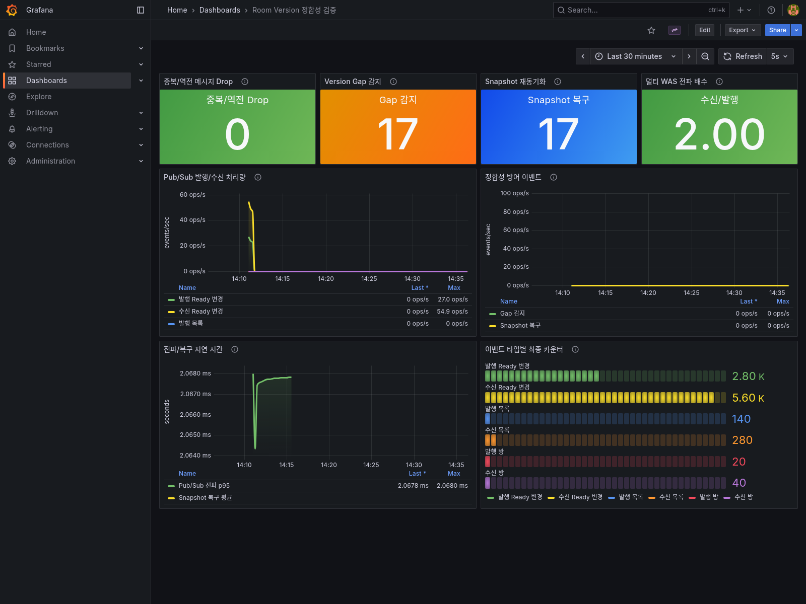
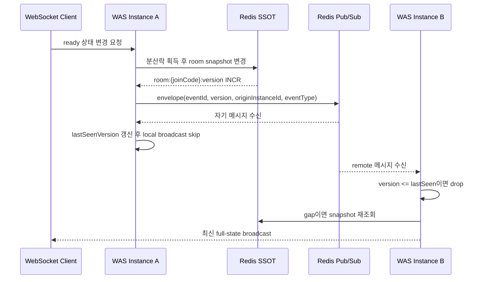

# Redis Room Version 정합성 검증 보고서

작성일: 2026-04-27

## 결론

Redis를 room 상태의 SSOT로 두고 Redis Pub/Sub으로 WebSocket 메시지를 전파하는 구조에서, Pub/Sub의 중복/역전/gap 가능성을 서버 subscriber 단계에서 방어하도록 구현했다.

핵심 전략은 모든 상태 변경 성공 시 Redis의 `room:{joinCode}:version`을 증가시키고, Pub/Sub envelope에 `eventId`, `version`, `originInstanceId`, `eventType`을 포함하는 것이다. Subscriber는 방별 `lastSeenVersion`보다 작거나 같은 메시지를 drop하고, gap을 감지하면 Redis snapshot을 다시 읽어 full-state broadcast로 복구한다.

Lua Script는 사용하지 않았고, 상태 변경 원자성은 분산락 흐름에 맡기면서 Redis SSOT + version 기반 subscriber 방어로 정리했다.



## 채용 관점 핵심 어필

- Redis Pub/Sub을 신뢰 가능한 이벤트 로그로 오해하지 않고, 중복/역전/gap이 가능한 전파 채널로 모델링했다.
- Redis snapshot을 authoritative state로 두고, Pub/Sub 메시지는 UI 전파 신호로만 사용하도록 책임을 분리했다.
- 단순 구현이 아니라 부하 테스트, Prometheus 지표, Grafana 캡처까지 연결해 주장 가능한 수치를 확보했다.
- “동시성 문제가 있을 수 있다” 수준이 아니라, gap을 실제로 관측하고 snapshot resync가 같은 횟수로 발생하는지 검증했다.

## 문제 정의

기존 구조는 여러 WAS 인스턴스가 Redis Pub/Sub 메시지를 받아 WebSocket으로 방 상태를 전파한다. 이 구조에서는 다음 문제가 생길 수 있다.

- 같은 이벤트가 여러 subscriber 경로에서 중복 처리될 수 있다.
- 메시지 도착 순서가 방 상태 변경 순서와 다를 수 있다.
- subscriber가 일부 메시지를 놓치면 클라이언트가 stale 상태를 볼 수 있다.
- Redis는 최신 snapshot을 갖고 있어도 WebSocket 전파 순서가 UI 정합성을 깨뜨릴 수 있다.

따라서 Pub/Sub 메시지를 그대로 믿지 않고, 각 메시지가 어떤 방 상태 version을 반영하는지 검증해야 한다.

## 설계



## 구현 범위

| 영역 | 파일 | 내용 |
|---|---|---|
| Pub/Sub envelope | `src/main/java/coffeeshout/global/messaging/PubSubEnvelope.java` | `eventId`, `version` 추가 |
| Redis roomVersion | `src/main/java/coffeeshout/room/infra/redis/RedisRoomRepository.java` | `room:%s:version` 증가, TTL, 삭제 정리, versioned publish |
| Subscriber 방어 | `src/main/java/coffeeshout/global/messaging/PubSubSubscriber.java` | stale drop, gap 감지, snapshot resync, self-message version tracking |
| Metric | `src/main/java/coffeeshout/global/metric/PubSubMetricService.java` | stale/gap/resync counter, propagation/resync timer |
| 단위 테스트 | `src/test/java/coffeeshout/global/messaging/PubSubSubscriberVersionTest.java` | 정상 순서, 중복/drop, gap 복구, 자기 메시지 skip, unknown event 검증 |
| 동시성 테스트 | `src/test/java/coffeeshout/concurrency/LuaAtomicityConcurrencyTest.java` | 동시 입장 상황에서 roomVersion 증가 검증 |
| 부하 테스트 | `load-test/scenarios/room-version-storm.yml` | 20개 방 ready storm 시나리오 |
| Grafana | `monitor/grafana/dashboards/room-version-consistency-dashboard.json` | 한국어 정합성 대시보드 |
| 캡처 renderer | `monitor/grafana/renderer/Dockerfile` | `Noto Sans CJK KR` 포함 renderer 이미지 |

## 부하 테스트 조건

실행 환경:

- WAS 2대
- Nginx reverse proxy
- Redis Pub/Sub
- Prometheus + Grafana
- Artillery 기반 room ready storm

시나리오:

- 20개 방 생성
- 방당 8명 입장
- host ready 변경은 도메인 정책상 무시
- guest 7명이 각 방에서 20회 ready 상태 변경

실행 명령:

```bash
TARGET_HOST=http://localhost:8000 npm run test:room-version -- --output ../_workspace/mission_room_version_consistency/evidence/room-version-storm-report.json
```

## 측정 결과

| 지표 | 결과 |
|---|---:|
| Redis `room:*:version` key 수 | 20 |
| Redis roomVersion 분포 | 20개 방 모두 version 148 |
| `PLAYER_READY` 발행 | 2800 |
| `PLAYER_LIST_UPDATE` 발행 | 140 |
| `ROOM_CREATE` 발행 | 20 |
| `PLAYER_READY` 수신 | 5600 |
| Version gap 감지 | 17 |
| Snapshot 재동기화 | 17 |
| Stale/중복 drop | 0 |
| Pub/Sub 전파 p95 | 약 2.07ms |
| Snapshot 복구 평균 | 약 3.02ms |
| 전체 시나리오 시간 | 16초 |
| Artillery 시나리오 실패 | 0 |

해석:

- `roomVersion=148`은 `room 생성/입장 setup 8회 + guest 7명 * ready 변경 20회`와 일치한다.
- 수신량이 발행량의 약 2배인 이유는 WAS 2대가 같은 Redis Pub/Sub channel을 구독하기 때문이다.
- Version gap 17회가 관측됐고, snapshot resync도 17회 발생했다. 즉 gap을 감지하고 Redis SSOT 기반 full-state 복구가 실행됐다.
- Stale/중복 drop은 이번 시나리오에서는 0회였지만, 해당 방어 로직은 단위 테스트에서 별도로 검증했다.

## Grafana 증거

대시보드는 한국어 라벨과 큰 stat panel 중심으로 구성했다.

주요 패널:

- 중복/역전 메시지 Drop
- Version Gap 감지
- Snapshot 재동기화
- 멀티 WAS 전파 배수
- Pub/Sub 발행/수신 처리량
- 정합성 방어 이벤트
- 전파/복구 지연 시간
- 이벤트 타입별 최종 카운터

스크린샷:

- `_workspace/mission_room_version_consistency/evidence/grafana_screenshots/room-version-dashboard-renderer.png`

렌더링 방식:

- `grafana/grafana-image-renderer` 기반 커스텀 renderer
- `fonts-noto-cjk` 설치
- `fontconfig`에서 한국어 sans-serif fallback을 `Noto Sans CJK KR`로 고정

## 주요 PromQL

```promql
sum(pubsub_message_stale_drop_total{job="spring-boot-app"}) or vector(0)
sum(pubsub_message_gap_detected_total{job="spring-boot-app"}) or vector(0)
sum(room_snapshot_resync_total{job="spring-boot-app"}) or vector(0)

sum(rate(pubsub_message_published_total{job="spring-boot-app"}[1m])) by (eventType)
sum(rate(pubsub_message_received_total{job="spring-boot-app"}[1m])) by (eventType)

histogram_quantile(0.95, sum(rate(pubsub_propagation_delay_seconds_bucket{job="spring-boot-app"}[5m])) by (le))
sum(rate(room_snapshot_resync_duration_seconds_sum{job="spring-boot-app"}[5m]))
/
sum(rate(room_snapshot_resync_duration_seconds_count{job="spring-boot-app"}[5m]))
```

## 이력서 문장 후보

- Redis Pub/Sub 기반 WebSocket 전파 구조에서 메시지 중복/역전/gap 가능성을 식별하고, Redis roomVersion 기반 subscriber 검증과 snapshot resync를 구현해 서버 측 상태 전파 정합성을 보강했습니다.
- 2대 WAS 환경에서 20개 방, 방당 8명, guest ready 변경 2,800건의 부하 시나리오를 구성하고 Prometheus/Grafana로 gap 감지 17회, snapshot resync 17회, Pub/Sub 전파 p95 약 2.07ms를 검증했습니다.
- Pub/Sub을 신뢰 가능한 ordered log가 아닌 best-effort propagation channel로 모델링하고, Redis SSOT snapshot 재조회로 복구하는 구조를 설계했습니다.

## 포트폴리오에서 안전한 주장

안전한 주장:

- Redis Pub/Sub의 순서/중복 보장 한계를 인식하고 서버 subscriber 단계에서 방어했다.
- Redis roomVersion을 이용해 stale message drop과 gap recovery를 구현했다.
- 부하 테스트와 Grafana 지표로 recovery path가 실제로 동작하는 것을 검증했다.

위험한 주장:

- Redis Pub/Sub 메시지의 total ordering을 보장했다.
- 모든 클라이언트 UI stale 문제를 완전히 해결했다.
- production 규모의 장애 대응 수치를 확보했다.

## 남은 보완

- 클라이언트 `version <= currentVersion` drop 로직은 아직 미구현이다. 현재 검증 범위는 서버 subscriber 방어와 snapshot resync까지다.
- 최종 포트폴리오 캡처 전에는 부하 테스트를 다시 실행해 Grafana time window 안에 최신 spike가 남도록 해야 한다.
- 현재 수치는 로컬 멀티 WAS 환경 기준이므로, 제출용 문장에는 측정 환경을 함께 표기해야 한다.

## 최종 판정

`PARTIAL_READY`

서버 측 Redis roomVersion 정합성 방어와 metric evidence는 포트폴리오 소재로 사용할 수 있다. 다만 “서버+클라이언트 양쪽 version 검증”이라고 주장하려면 클라이언트 stale drop까지 추가 구현한 뒤 다시 캡처해야 한다.
