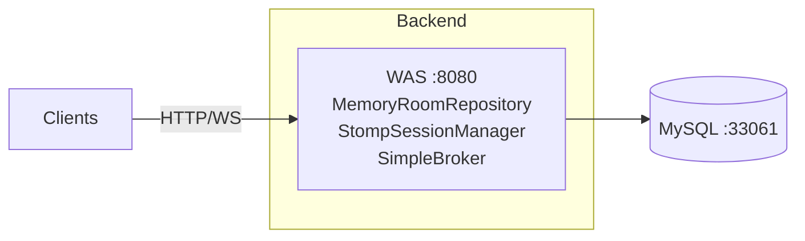
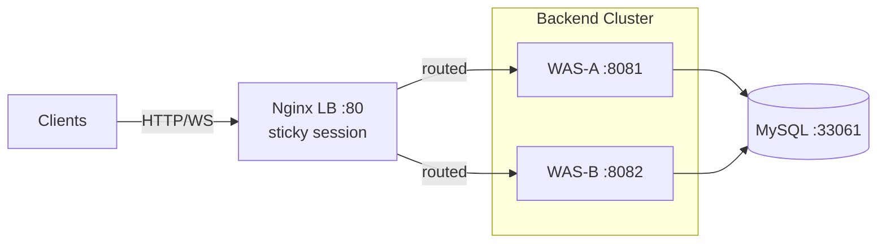
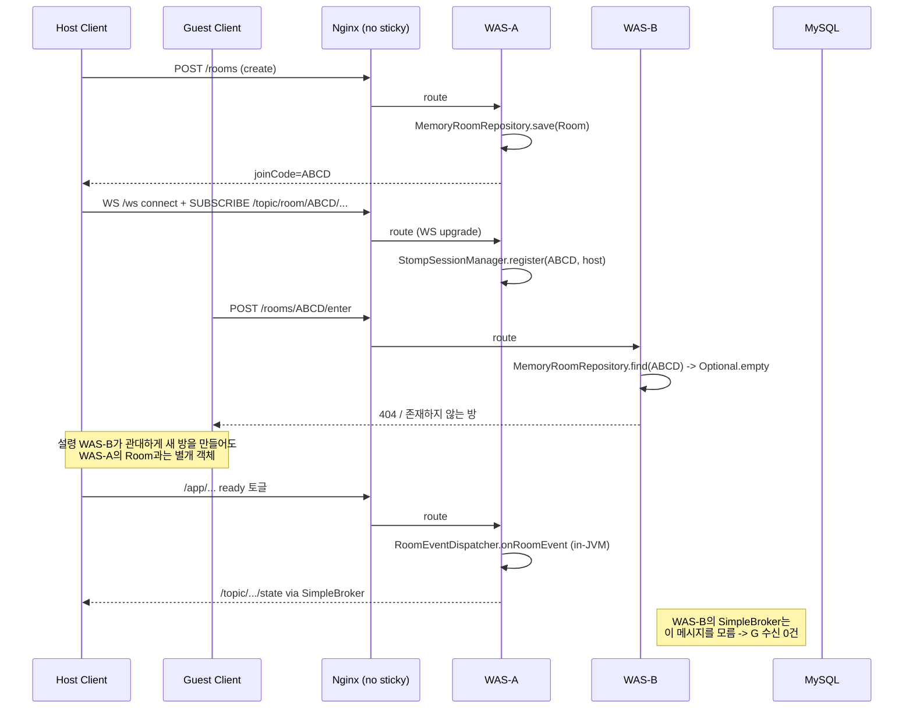
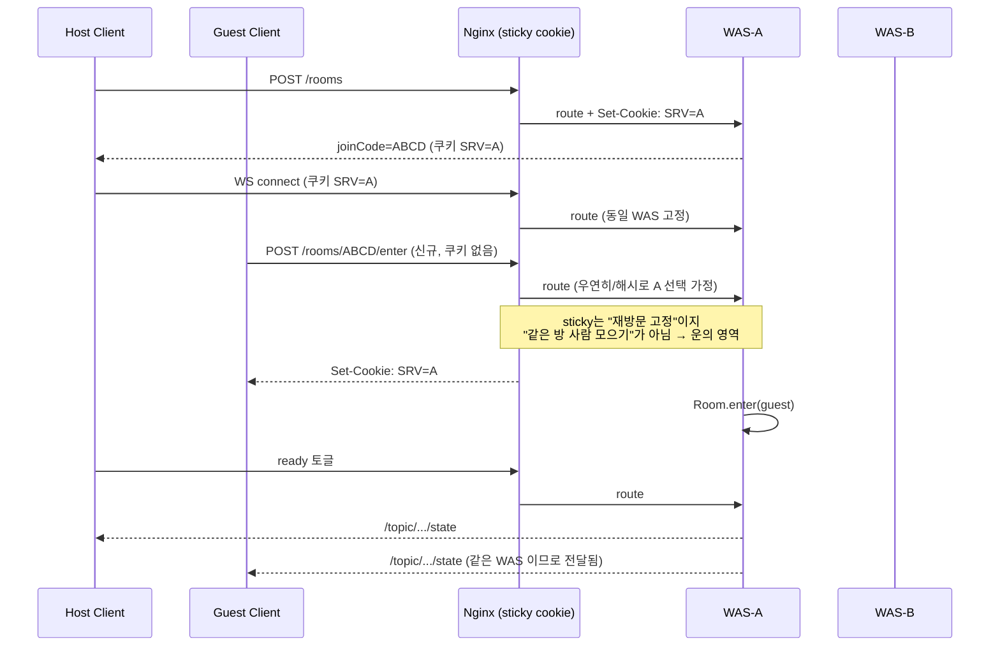

# 실험 설계: 스케일 아웃 — 다른 WAS 유저에게 이벤트가 안 감

## 문제 정의

### 분산 문제명
**Split-Brain Room State** — 같은 `JoinCode`를 공유하는 플레이어들이 서로 다른 WAS 인스턴스에 분산 접속할 때, 각 WAS가 독립된 메모리 상태를 가지면서 "같은 방"이 물리적으로 여러 벌로 쪼개져 존재하게 되는 현상.

### 근본 원인
1. `MemoryRoomRepository`는 `ConcurrentHashMap<JoinCode, Room>` 기반 — 프로세스 메모리에만 존재.
2. `StompSessionManager`도 프로세스 메모리 기반 — 세션 매핑이 WAS 로컬.
3. `RoomEventDispatcher`는 Spring `@EventListener` — **같은 JVM 내부에서만** 이벤트가 전파됨 (`ApplicationEventPublisher`는 크로스 프로세스 기능 없음).
4. STOMP SimpleBroker(`enableSimpleBroker`)는 **인-메모리 브로커** — 이 WAS에 연결된 세션에만 메시지를 보낼 수 있음.

결과적으로 WAS-A에 생성된 `Room`은 WAS-B 입장에서 "존재하지 않는 방"이며, WAS-A에서 퍼블리시된 `/topic/room/{joinCode}/...` 메시지는 WAS-B의 STOMP 세션에 절대 닿지 않는다.

### baseline과의 대비
baseline은 WAS 1대 전제. 위 세 컴포넌트 모두 "단일 프로세스" 가정 위에서 동작하므로 정상 작동했다. WAS를 2대 이상으로 늘리는 순간 이 가정이 깨진다.

### 이전 시나리오와의 연결
이번이 첫 스프린트. 이 시나리오는 "왜 분산 상태 저장/메시징이 필요한가"를 드러내는 시작점. 임시 해결(Sticky Session)은 **Sprint 2에서 자기 한계를 스스로 드러내도록** 의도적으로 남기는 부채다.

---

## 인프라 토폴로지

### 변경 전 (baseline)

- WAS 1대, Docker Compose `app` + `mysql`
- 포트: `8080:8080`, `33061:3306`

### 변경 후 (Sprint 1 실험)

| 항목 | 값 | 비고 |
|---|---|---|
| WAS 수 | **2대 (추천)** | 재현에 필요한 최소 규모. 대안: 3대(분산도 검증 강화, 실험 복잡도 증가) |
| WAS-A 포트 | `8081:8080` | LB 경유 전용 (직접 접근은 재현 디버깅 용도) |
| WAS-B 포트 | `8082:8080` | 동일 |
| LB | Nginx `:80` | upstream에 WAS-A, WAS-B 등록 |
| MySQL | 공용 `:33061` | WAS 간 동일 DB 공유 (baseline과 동일) |
| sticky key | **쿠키 기반 (추천)** | `sticky cookie` 또는 Nginx Plus `sticky`, 커뮤니티판은 `nginx-sticky-module` 또는 `ip_hash`로 대체 |

**재현용 직접 포트 노출(`8081`, `8082`)** 을 두는 이유: 문제 재현 단계에서는 LB sticky를 **끈 상태**와 **임의 WAS 지정**을 모두 시뮬레이션해야 하므로 클라이언트가 특정 WAS를 선택해 접속할 수 있어야 한다.

---

## 재현 시나리오

### 전제
- 컴포즈 구성: MySQL 1 + WAS-A + WAS-B + Nginx LB (sticky **off**)
- 스케일 아웃만 했을 뿐, 방 데이터 저장/이벤트 전파 기법은 baseline 그대로.

### 절차 (step-by-step)

1. **기동**
   - `docker compose -f docker-compose.scale.yml up -d`
   - 헬스체크 통과 대기(WAS-A, WAS-B 둘 다 `/actuator/health` UP).

2. **호스트 → WAS-A 고정**
   - 클라이언트 1(호스트): `http://localhost:8081` 로 직접 방 생성 API 호출 → `joinCode` 획득.
   - 같은 클라이언트가 `ws://localhost:8081/ws` STOMP 연결, `/topic/room/{joinCode}/...` 구독.

3. **게스트 → WAS-B 고정**
   - 클라이언트 2(게스트): `http://localhost:8082` 로 `enter` API 호출 (같은 `joinCode` 사용).
   - STOMP 연결도 `ws://localhost:8082/ws` 로 진행.

4. **장애 유도 액션**
   - 호스트가 ready 토글 같은 상태 변경을 발생 → WAS-A에서 `RoomEvent` 발행.
   - 게스트 측에서 동일한 ready 토글 시도.

5. **관찰**
   - 각 WAS 로그, 각 클라이언트의 구독 메시지 수신 여부.

### 재현에 쓰는 테스트 도구
- `load-test/scenarios/baseline.yml` 을 변형한 **새 시나리오 `split-brain.yml`** 제안 (기존 processor/helper 재사용).
  - 변수로 `HOST_TARGET=http://localhost:8081`, `GUEST_TARGET=http://localhost:8082` 분리.
  - `set-up.js`의 방 생성은 `HOST_TARGET`으로, 게스트 `connectWebSocket`은 `GUEST_TARGET`으로 강제.
  - 구현 상세는 developer 단계에서 결정.

### 예상 장애 증상/로그

| WAS | 관찰되는 증상 | 대표 로그 |
|---|---|---|
| WAS-B | 게스트의 `enter` 요청 시 방을 찾지 못함 | `"존재하지 않는 JoinCode입니다"` 또는 Optional.empty로 분기된 예외 |
| WAS-B | 설령 게스트가 STOMP 구독을 성공해도 WAS-A가 퍼블리시한 `/topic/...` 메시지는 **0건 수신** | 게스트 측 subscribe 콜백 호출 없음 |
| WAS-A | 호스트의 이벤트는 WAS-A 내부 SimpleBroker에만 전달 | 호스트 1명만 메시지 수신, `getConnectedPlayerCountByJoinCode = 1` |
| WAS-A | `StompSessionManager`에 게스트 매핑 부재 | `"플레이어 세션이 존재하지 않습니다"` 예외 가능 |

### 성공/실패 판정 기준 (재현 단계 = "실패를 재현하는 데 성공")

- **재현 성공 조건 (모두 충족):**
  1. 게스트의 `enter` 호출이 WAS-B에서 4xx/5xx로 실패하거나, 설령 WAS-B가 별도 방을 신규 생성해도 호스트의 방과 **ID가 다른 방**이 만들어진다.
  2. 호스트가 ready 토글 시 WAS-A 내부 구독자만 메시지를 받고 게스트는 30초 내 0건 수신.
  3. WAS-A와 WAS-B의 `MemoryRoomRepository`를 Actuator/디버그 엔드포인트로 덤프했을 때 서로 다른 상태를 가진다.
- **재현 실패(= 문제 재현 자체가 실패):** 위 셋 중 하나라도 자동 해소되면 가설이 틀린 것. 토폴로지/세션 라우팅을 재점검.

---

## 해결 방향 (임시방편, Sprint 2에서 폐기 예정)

### 방향
Nginx LB에 sticky session을 도입해 **동일 클라이언트는 항상 동일 WAS에 바인딩**. 같은 방의 호스트/게스트가 같은 WAS로 뭉치도록 간접 보장.

### Nginx sticky 방식 비교

| 방식 | 키 | 장점 | 단점 | 이 실험에 적합? |
|---|---|---|---|---|
| `ip_hash` | 클라이언트 IP | 커뮤니티판 Nginx에 기본 내장, 설정 1줄 | 같은 사내/NAT에서 여러 사용자가 같은 WAS로 쏠림. 모바일 IP 변동 시 세션 끊김 | 로컬 Docker 재현에서는 **클라이언트 IP가 Docker 브리지 하나로 단일**이라 전부 한 WAS로 몰려 재현이 왜곡됨 → **부적합** |
| **쿠키 기반 sticky** | LB가 발급한 쿠키 | 클라이언트 단위 정확 매칭. Docker 네트워크에서도 분산됨 | 커뮤니티 Nginx는 서드파티 모듈(`nginx-sticky-module-ng`)이나 Nginx Plus 필요. 대안으로 `hash $cookie_xxx consistent;` 트릭 | **추천** |
| JoinCode 해시 | 요청의 `joinCode` 쿠키/헤더 | 방 단위로 WAS 고정 — 이론상 가장 정합적 | SockJS fallback, 핸드셰이크 시점에 `joinCode`가 URL/헤더에 없으면 못 씀. 구현 난이도 높음 | 대안 |

**추천: 쿠키 기반 sticky(또는 `hash $cookie_JSESSIONID consistent;`)**. 재현 장벽(로컬 IP 단일)을 우회할 수 있고, Sprint 2에서 "WAS-A가 죽으면 그 WAS에 묶여 있던 방들이 전부 증발한다"는 후속 장애를 깔끔히 드러내기 좋다.

### 트레이드오프 (Sprint 2가 드러낼 한계)

| 측면 | sticky 적용 후 | 내포된 문제 |
|---|---|---|
| 정합성 | 한 방의 모든 플레이어가 같은 WAS에 뭉침 | **방 상태는 여전히 단일 WAS 메모리** — 분산 상태가 된 게 아니라 "같은 섬에 몰아넣었을 뿐" |
| 가용성 | WAS 장애 시 해당 WAS에 묶인 **모든 방이 소멸** | ★ Sprint 2 핵심 시나리오 |
| 부하 분산 | 방 생성이 WAS에 라운드로빈으로 분배되면 대체로 균등 | 방별 트래픽 편차가 크면 핫스팟 발생 |
| 배포 | 한 WAS 롤링 재시작 = 그 WAS의 방 전멸 | ★ Sprint 9(배포) 와도 연결 |
| 재접속 | 같은 쿠키 유지되는 한 같은 WAS 복귀 | 쿠키 만료/브라우저 교체 시 다른 WAS로 이동 → 유실 재발 |

한 문장 요약: **Sticky는 "분산 문제를 해결"한 게 아니라 "단일 WAS인 척 가장"한 것**. 이 거짓말이 언제 깨지는지 보는 게 Sprint 2.

---

## 시퀀스 다이어그램

### 장애 시 (sticky off — 호스트는 WAS-A, 게스트는 WAS-B)

### 해결 시 (sticky on — 같은 방의 모두가 WAS-A로 고정)

> sticky의 **본질적 한계**가 다이어그램에 드러남: 게스트의 첫 요청이 우연히 WAS-B로 갔다면 sticky는 여전히 문제를 못 막는다. Sprint 2 장애 모델링에 이 틈이 그대로 이어진다.

---

## 검증 계획

### 1차: 해결 적용 후 동일 재현 시나리오 통과 기준
- `split-brain.yml` 을 sticky **on** 상태로 재실행.
- 통과 조건:
  1. 게스트의 `enter` 성공률 ≥ **99%** (1회/100회의 WAS 분리는 sticky의 구조적 틈 — 알려진 한계로 기록).
  2. 호스트 이벤트 → 게스트 수신 **실측 수신율 ≥ 99%**.
  3. 양 WAS 로그에서 `"플레이어 세션이 존재하지 않습니다"` 예외 0건.

### 2차: 추가 엣지 케이스

| 케이스 | 시나리오 | 기대 결과 | 드러날 문제 |
|---|---|---|---|
| E1. 쿠키 유실 | 게스트가 쿠키 없이 접근 | 50% 확률로 WAS-B 라우팅 → 재현 조건 재성립 | sticky의 구조적 틈 |
| E2. WAS 재시작 | WAS-A만 `docker restart` | WAS-A에 묶여있던 방 전체 소멸, 클라이언트 재연결은 여전히 WAS-A 쿠키로 시도 → 503/새 방 | **Sprint 2 직결** |
| E3. 쿠키 만료/교체 | 동일 사용자가 시크릿창으로 재입장 | 다른 WAS로 라우팅 → Split-Brain 재발 | sticky 가장의 얇음 |
| E4. 스케일 업 | WAS-C 추가 | 신규 방은 WAS-C로 일부 라우팅, 기존 방은 그대로 | 샤드 리밸런싱 부재 |
| E5. 방 WAS 고정 장시간 유지 | 한 WAS에 방이 계속 쌓임 | 메모리 편중 가능 | 분산 스토리지 부재의 후유증 |

### 측정 지표
- 클라이언트 측 `/topic/...` 수신 카운트 (processor에 누적 로깅 추가 — developer 단계).
- WAS 측 `getConnectedPlayerCountByJoinCode(joinCode)` 값 — 같은 방이면 한 WAS에서 `호스트+게스트 수`, 다른 WAS에서 `0`이어야 sticky 성공.
- WAS별 방 개수 편차.

### 다음 스프린트로 넘기는 미해결
- 방 상태의 **크로스-WAS 가시성 부재** (여전히 메모리 로컬).
- **WAS 단일 장애 = 방 전멸** (Sprint 2 메인 테마).
- **이벤트 크로스-WAS 전파 부재** (Sprint 3에서 Redis 도입 시 해결).

---

## 사용자 확인 필요 결정사항

1. **WAS 개수**: 추천 **2대**. 대안 3대(분산도 검증 ↑, 운영 복잡도 ↑).
2. **sticky 방식**: 추천 **쿠키 기반**(`hash $cookie_XXX consistent;` 또는 sticky 모듈). 대안 `ip_hash`(단순하나 Docker 로컬 재현 왜곡).
3. **LB 포트 노출**: 추천 `Nginx :80` + WAS 직접 포트 `8081/8082` 둘 다 노출(재현 디버깅 용). 대안 LB 포트만 노출(현실 구성에 가까움, 재현이 번거로움).
4. **재현 artillery 시나리오**: 신규 `split-brain.yml` 작성(`HOST_TARGET`/`GUEST_TARGET` 분리). 또는 기존 `baseline.yml` 환경변수 오버라이드만으로 처리.
5. **MySQL 포지션**: 현재 설계는 방 상태를 DB에 내려쓰지 않음(baseline 그대로). WAS 간 방 공유를 DB로 급조할지 여부 — 추천은 **하지 않음**(Sprint 3 Redis 도입 동기를 약화시킴).
