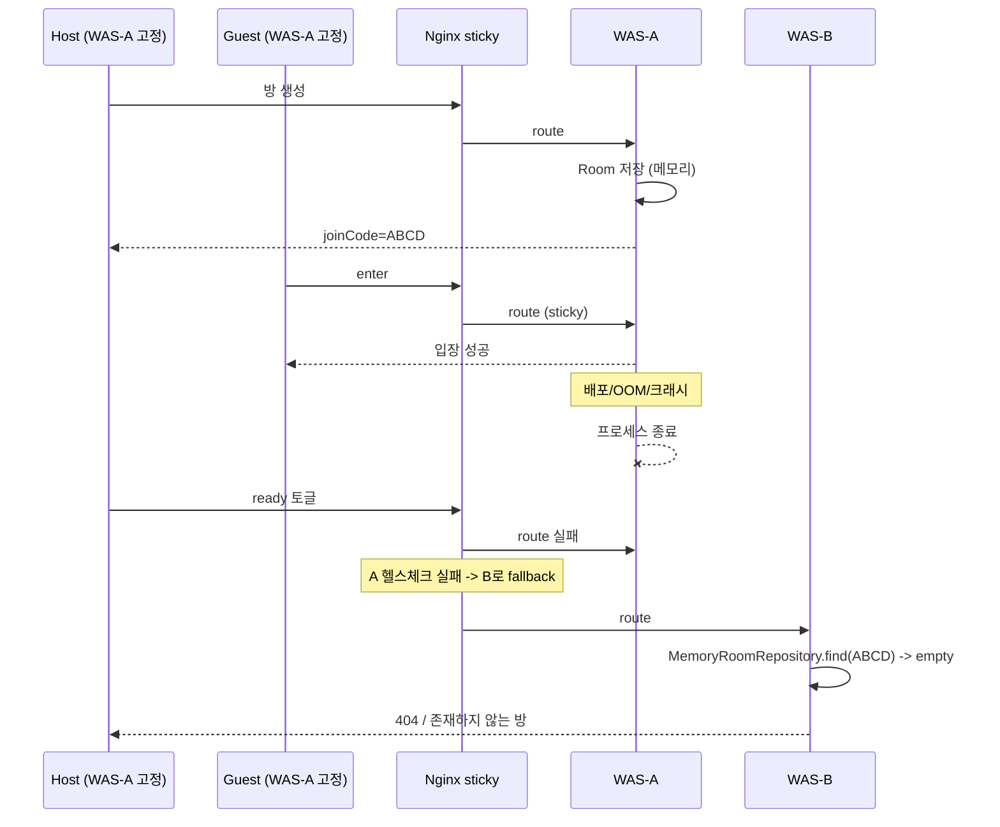
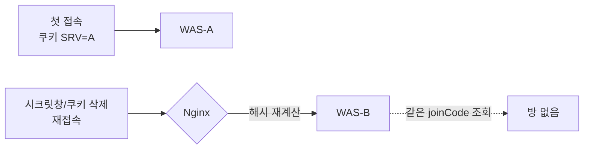
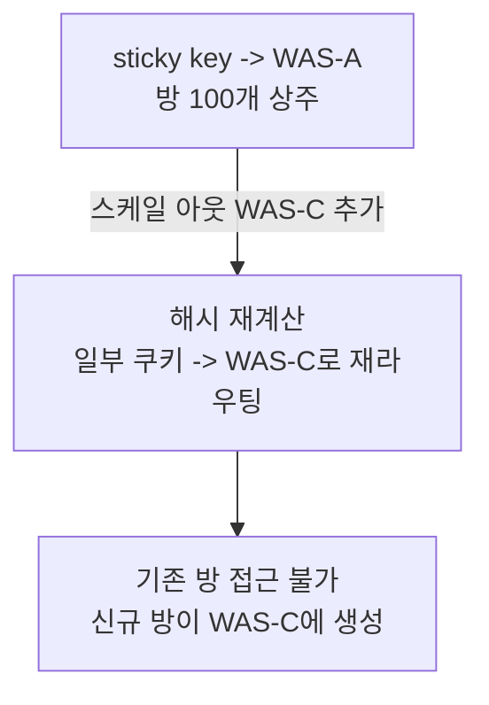
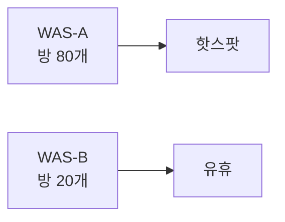

# 실험 설계: Sticky Session의 한계 — 방 전멸과 분산 가장의 파괴

## 문제 정의

### 분산 문제명
**Sticky Illusion Collapse** — Sprint 1에서 도입한 sticky session은 "분산 문제를 해결"한 것이 아니라 "단일 WAS인 척 가장"한 것. 이 가장(illusion)이 특정 조건에서 파괴되며 단순한 split-brain보다 더 심각한 장애를 유발한다.

### 근본 원인
Sprint 1 설계의 결정적 한계를 그대로 상속한다:
1. **방 상태는 여전히 WAS 메모리**. sticky는 "같은 클라이언트의 재방문"을 같은 WAS로 고정할 뿐, 방 자체를 다른 WAS로 옮기는 능력이 없다.
2. **sticky는 쿠키/해시 기반**. 쿠키 유실·만료·교체, 신규 클라이언트의 첫 접속은 어느 WAS로 갈지 lb 해시에 맡겨진다.
3. **WAS는 개별 장애 단위**. 프로세스가 죽으면 그 WAS 메모리의 방 데이터 전체가 같이 사라진다.

### 이전 시나리오와의 연결
Sprint 1의 "split-brain 일시 봉합" 덕분에 **같은 방의 호스트/게스트가 한 WAS에 몰리는** 정상 경로는 확보됐다. 그 정상 경로가 얼마나 얇은 얼음판 위에 서 있는지를 Sprint 2가 드러낸다.

---

## 핵심 실패 모드

### 실패 모드 A — WAS 단일 장애 = 방 전멸



**증상**
- 해당 WAS에 생성되어 있던 **모든 방**이 일제히 "존재하지 않는 방"이 된다.
- 사용자 입장에서는 게임 도중 갑자기 방이 사라지는 형태로 보인다.
- LB가 살아 있는 다른 WAS로 fallback해도 거기엔 해당 방이 없으므로 복구 불가.

**왜 Sprint 1의 sticky로 못 막나**
- sticky는 "라우팅" 층의 해결책. 스토리지 층의 휘발성은 건드리지 못함.

### 실패 모드 B — 쿠키 유실·만료·교체



**증상 시나리오**
- 모바일 네트워크에서 쿠키 드롭 → 같은 사용자가 다른 WAS로 라우팅 → 자기 방을 못 찾음.
- 시크릿창/다른 브라우저 입장 → sticky 무효 → 다른 WAS로 감 → Sprint 1의 split-brain 재발.
- QA 중 쿠키 만료 시간 초과 → 장시간 비활성 사용자가 돌아오면 다른 WAS에 방이 "신규 생성"되어 원래 방과 분리.

**관찰 지표**
- 게스트의 `enter` 실패율이 시간에 따라 선형 증가 (쿠키 만료 누적).
- 동일 joinCode로 두 WAS에 각기 다른 Room 객체가 존재 (WAS별 덤프 비교).

### 실패 모드 C — 스케일 조정 시 해시 재분배



**증상**
- 운영 중 WAS 추가/제거 시 `hash $cookie_X consistent;`의 consistent hash도 **일부 키 재분배**는 불가피.
- 재분배된 클라이언트는 자기 방이 있는 WAS로 더 이상 가지 않음.

### 실패 모드 D — 세션 수 편중



**증상**
- sticky는 "요청을 WAS에 고정"하므로 방 트래픽 편차가 그대로 WAS 부하 편차.
- 특정 방에서 연속 탭 이벤트가 폭주하면 그 WAS만 CPU/메모리 상승, 다른 WAS는 놀고 있음.
- 스케줄러(`DelayedPlayerRemovalService`)까지 편중된 WAS에 쏠려 타이머 폭주.

---

## 장애 모드 총정리

| 모드 | 트리거 | 증상 범위 | 복구 가능성 | Sprint 1 sticky로 해결? |
|---|---|---|---|---|
| A. WAS 장애 | 배포/크래시/OOM | 해당 WAS의 **모든 방** | 불가 | ❌ |
| B. 쿠키 유실 | 시크릿/만료/삭제 | 개별 사용자 | 부분 | ❌ |
| C. 스케일 조정 | WAS add/remove | 재분배 대상 방 | 불가 | ❌ |
| D. 부하 편중 | 방 트래픽 편차 | 특정 WAS | 스케일 업으로 완화 | ❌ |

→ sticky는 **단일 WAS인 척 잘 굴러가는 happy path**만 봉합할 뿐, 분산 시스템의 4대 현실(장애/세션/탄력성/부하분산) 전부에서 무력하다.

---

## 재현 가능성 (실제 재현은 skip)

각 모드별 재현 레시피는 정의 가능하나 이번 스프린트에서는 구현하지 않는다. Sprint 3에서 Redis SSOT 도입 후 이 시나리오들이 **자동 해결되는지** 역검증으로 확인한다.

```
모드 A 재현: docker compose kill app_a && artillery 실행 -> 클라이언트 방 404 확인
모드 B 재현: 쿠키 수동 삭제 -> 재접속 -> 방 분리 확인
모드 C 재현: docker compose scale app=3 -> 일부 클라이언트가 신규 WAS로 라우팅 확인
모드 D 재현: 단일 방에 tap 폭증 -> WAS별 CPU 지표 비교
```

---

## 결론 — Sticky 폐기 결정

sticky session은 분산 문제의 **증상**을 가리는 쿠션이지 해결책이 아니다. 네 가지 실패 모드 모두 "WAS 메모리를 상태 저장소로 쓰는 한" 구조적으로 회피 불가능하다.

**Sprint 3 진입 근거**
- 해결의 방향은 "라우팅 층"이 아니라 **"저장 층"을 분산 공유로 바꾸는 것**.
- 방 상태를 WAS 외부 SSOT로 이관하면:
  - 모드 A: 다른 WAS가 같은 방에 접근 가능 → WAS 장애에도 방 생존
  - 모드 B: 어느 WAS로 라우팅되든 방 보임 → 쿠키 의존 제거
  - 모드 C: 스케일 조정과 방 소유권 무관 → 재분배 영향 없음
  - 모드 D: 방 상태가 공유 저장소에 있으므로 WAS는 거의 stateless → 부하 고른 분산
- sticky 자체를 폐기하고 **stateless WAS + Redis SSOT + Pub/Sub**으로 전환.

**Sprint 3가 도입할 것**
- Redis Hash/Set을 방 상태 저장소로
- Redis Pub/Sub을 WAS 간 이벤트 전파로
- 필요한 원자 연산은 Lua로 (동시성/멱등성 기반)
- `DelayedPlayerRemovalService`는 Sprint 7에서 Sorted Set + 폴링으로 교체 예정 (이번엔 건드리지 않음)

---

## 미해결 / 다음 단계로 넘기는 주제

| 주제 | 스프린트 |
|---|---|
| 이벤트 전파 기술 선택 (Pub/Sub vs Stream) | Sprint 3 |
| Thundering herd 재접속 | Sprint 4 |
| Pub/Sub fire-and-forget 유실 | Sprint 5 |
| 멀티스레드 처리 순서 | Sprint 6 |
| 타이머 소멸/중복/유실 | Sprint 7 |
| 재전송 멱등성 | Sprint 8 |
| 무중단 배포 | Sprint 9 |

Sprint 2는 **sticky 폐기**만 확정하고 다른 문제는 각 스프린트로 위임한다.

---

## 참조

- `_workspace/sprint_1/01_architect_design.md` — Split-Brain 재현 설계 (Sprint 1 원안, 실제 재현은 skip)
- `_workspace/insights/01_why_redis_ssot.md` — Redis SSOT 선택 논증
- `_workspace/insights/02_actual_problems_in_project.md` — 이 프로젝트에서 실제 발생한 SSOT 부재 문제 12건 (특히 모드 A의 구체 증거: #7 Session 동기화, #8 DelayedPlayerRemovalService)
