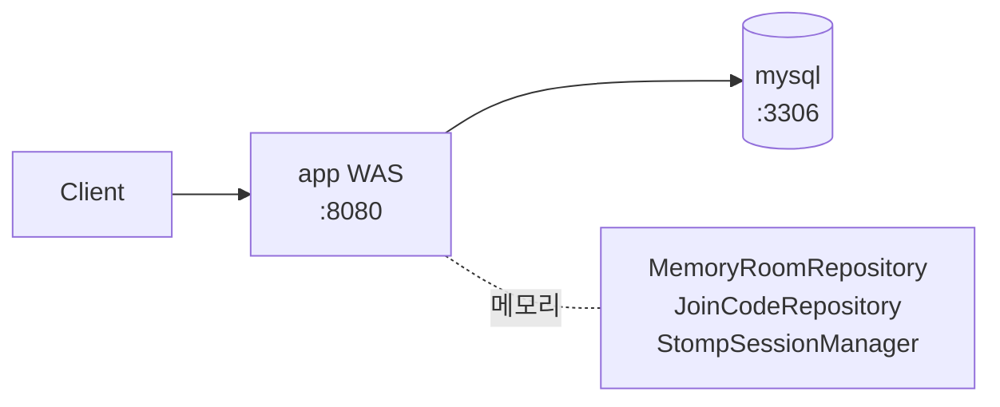
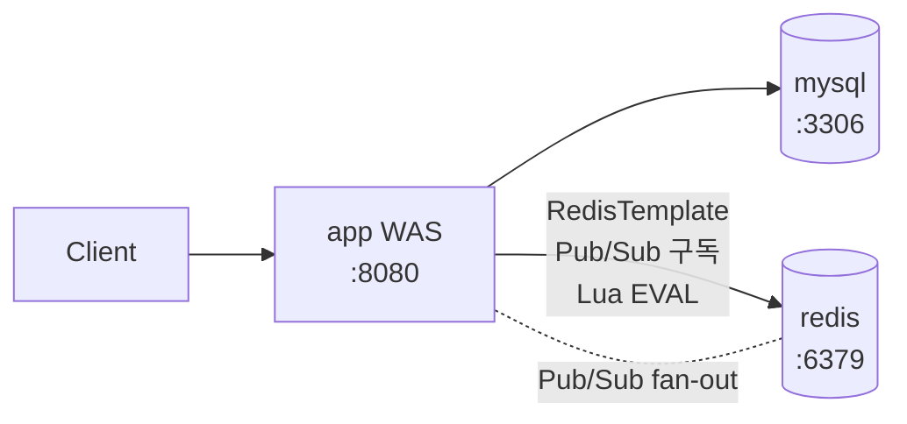
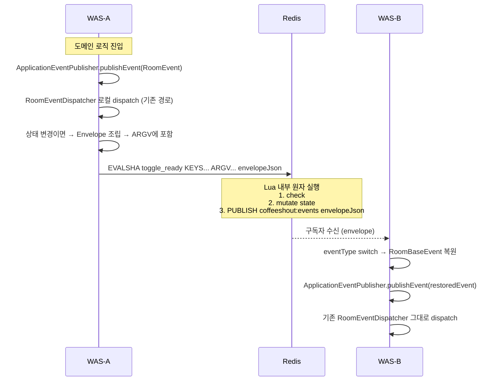
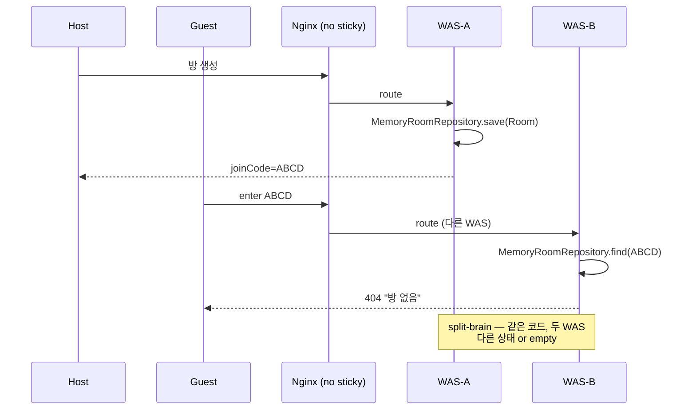
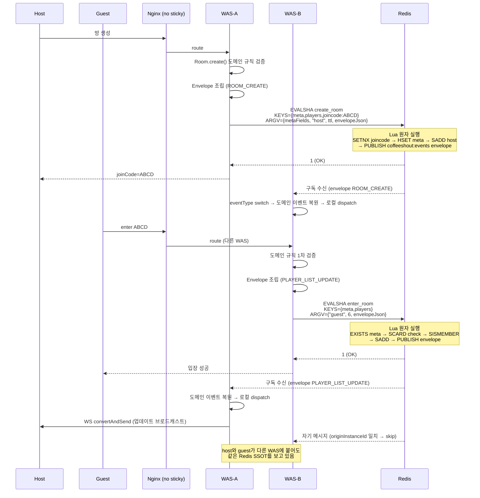
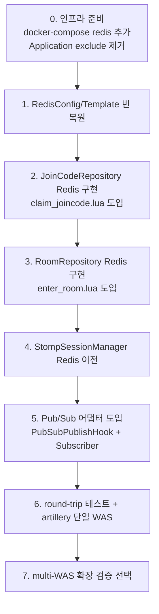

# 실험 설계 Sprint 3: Redis SSOT + Pub/Sub + Lua 도입

## 1. 문제 정의

### 배경 — Sprint 1-2 skip 맥락

Sprint 1(스케일 아웃)과 Sprint 2(sticky session 한계)는 실제 재현 없이 문서로만 마무리했다. 두 스프린트의 결론이 하나의 선택으로 수렴했기 때문이다.

| 스프린트 | 결론 | 다음 방향 |
|---|---|---|
| Sprint 1 | WAS 메모리가 상태 저장소면 split-brain은 구조적으로 발생 | Sticky로 증상만 가림 |
| Sprint 2 | Sticky는 쿠키 유실/WAS 장애/스케일 조정/부하 편중 네 군데 모두에서 무력 | 저장 층을 공유로 바꿔야 함 |

Sprint 3는 "저장 층을 WAS 메모리 → Redis로 이전"을 실측 구현하는 스프린트다. Sprint 4~9의 기반이 된다.

### 이번 스프린트가 푸는 문제

1. **상태 SSOT 부재** — 같은 `joinCode`의 Room 객체가 WAS별 `ConcurrentHashMap`에 따로 존재. host와 guest가 다른 WAS에 붙으면 상태가 두 벌로 갈라진다.
2. **크로스-WAS 이벤트 전파 부재** — `RoomEventDispatcher`는 Spring `ApplicationEventPublisher` 기반 로컬 디스패처라 다른 WAS의 WebSocket 세션에는 메시지가 닿지 않는다.
3. **joinCode 유일성** — `MemoryJoinCodeRepository.save()`가 `synchronized`로 로컬 동시성만 막음. 두 WAS가 동시에 같은 코드를 생성하는 것을 막지 못한다.
4. **세션 매핑 분절** — `StompSessionManager`의 두 `ConcurrentHashMap`이 WAS 로컬. 다른 WAS의 Disconnect를 볼 수 없다.

### 참고 문서

- `_workspace/insights/01_why_redis_ssot.md` — Stream/MySQL/Redis 대안 비교, 오해 교정
- `_workspace/insights/02_actual_problems_in_project.md` — 이 프로젝트에서 실제 발생한 12건
- `_workspace/sprint_2/01_sticky_session_limits.md` — sticky 폐기 결정

---

## 2. Motivation — 이 프로젝트가 겪은 실증

"일반론"이 아니라 커밋으로 증명된 사례 3개를 꼽는다.

### 실증 A — 다른 WAS에 붙은 유저에게 브로드캐스트가 안 감 (#1)
커밋 `6d2e6f6` 에서 `RoomEventPublisher/Subscriber`를 추가해 Pub/Sub으로 문제를 때웠다. WebSocket 세션이 STOMP 서버 로컬에만 매핑된다는 본질 때문에, "이벤트 = 상태"로 취급하는 순간 구독자마다 상태가 갈라진다. Sprint 3는 "**이벤트는 Redis를 읽으라는 신호**, 상태는 Redis 자체"라는 분리를 도입한다.

### 실증 B — joinCode 중복 생성 가능성 (#11)
`MemoryJoinCodeRepository`는 `synchronized`로 **한 WAS 내부**만 막는다. WAS가 둘이면 동시에 같은 코드를 생성할 수 있다. archive에 남은 `RedisJoinCodeRepository`가 `SETNX` + TTL로 이를 해결했다. Sprint 3는 이 패턴을 복원하되, Lua로 묶어 SETNX + TTL을 원자화한다.

### 실증 C — 세션 매핑 분절 (#7)
`StompSessionManager`의 `registerPlayerSessionInternal`/`removeSessionInternal` 같은 `Internal` 접미사 메서드는 "다른 WAS에서 일어난 변경을 Pub/Sub으로 받아 내 맵에 반영하기 위한 경로"다. Redis Hash로 SSOT를 올리면 `Internal` 계열이 통째로 사라지고 `ConcurrentHashMap` 2개도 제거된다.

Sprint 3 관점에서 이 세 증상의 공통점은 "WAS 메모리를 상태 저장소로 쓴다"는 **단일 선택**에서 파생됐다는 것. SSOT를 Redis로 옮기면 세 개가 한 번에 풀린다.

---

## 3. 인프라 토폴로지

### 변경 전 (baseline, 현재 main)



- 서비스 2개: `mysql`, `app`
- `CoffeeShoutApplication` 에서 `RedisAutoConfiguration`, `RedisReactiveAutoConfiguration`, `RedisRepositoriesAutoConfiguration`, `RedissonAutoConfigurationV2` 모두 exclude
- `application-docker.yml` 의 `redisson.enabled: false`

### 변경 후 (Sprint 3)



- 추가 서비스: `redis` (image `redis:7.2`, healthcheck `redis-cli PING`)
- `RedisAutoConfiguration`, `RedissonAutoConfigurationV2` exclude 제거 → 활성화
- `redisson.enabled` 를 락 사용 여부에 따라 결정 (하단 확인사항 1번)
- WAS 수 **1개 유지**. multi-WAS 검증은 Sprint 3 말미 또는 Sprint 4에서 별도로.

### docker-compose 서비스 구성

| 서비스 | image | 포트(호스트:컨테이너) | healthcheck | 비고 |
|---|---|---|---|---|
| mysql | mysql:8.0 | 33061:3306 | mysqladmin ping | 기존 유지 |
| redis | redis:7.2 | 6379:6379 (옵션) | redis-cli PING | 신규. 포트 노출은 확인사항 4번 |
| app | (local build) | 8080:8080 | actuator/health | `depends_on`에 redis 추가 |

---

## 4. Redis 데이터 구조 설계

### 4.1 키 네이밍 원칙

- 방 관련 키: `{joinCode}` **hash tag**로 감싸 cluster에서 동일 슬롯에 배치. 다중 키 Lua 작동 보장.
- 구분자: `:` 계층 구분. (`room:{ABCD}:ready`)
- 수명 스코프별 접두사: `room:`, `session:`, `joincode:`
- 게임 수명만 별도 TTL로 분리되는 키(`positions`)도 방 hash tag 공유

### 4.2 키별 스키마

#### 방 메타 (Hash)
- 키: `room:{joinCode}:meta`
- 수명: 방 수명 (TTL 예: 4h, 게임 종료 이벤트 시 DEL)
- 필드:
  | field | 값 타입 | 예시 |
  |---|---|---|
  | hostName | string | "호스트닉" |
  | state | string (enum) | "LOBBY" / "PLAYING" / "ENDED" |
  | gameType | string (enum) | "CARD_GAME" / "RACING_GAME" |
  | createdAt | epoch millis | "1712957712345" |
  | maxPlayers | int | "6" |
- 추상 `Playable` 인스턴스 저장 금지. `gameType` field만 두고 WAS에서 구체 타입 재조립.

#### 플레이어 목록 (Set)
- 키: `room:{joinCode}:players`
- 수명: 방 수명
- 값: playerName 문자열 집합. `{ "호스트", "게스트A", "게스트B" }`
- `SADD` 중복 방지 활용. 정원 확인은 `SCARD`.

#### Ready 상태 (Hash)
- 키: `room:{joinCode}:ready`
- 수명: 방 수명
- 필드: `playerName` → `"true"` / `"false"` (문자열)
- 전체 조회는 `HGETALL`, 단일 토글은 `HSET`.

#### 레이싱 위치 (Hash) — 게임 수명
- 키: `room:{joinCode}:positions`
- 수명: 게임 수명 (예: 300s TTL 자동 재설정)
- 필드: `playerName` → 정수 (이동한 거리)
- 100ms 주기 `HINCRBY` (파이프라인/Lua로 배치 가능).

#### 세션 매핑 (Hash, 양방향)
- 키 1: `session:player-to-session` — field=`{joinCode}:{playerName}`, value=`sessionId`
- 키 2: `session:session-to-player` — field=`sessionId`, value=`{joinCode}:{playerName}`
- 수명: WS 세션 수명 (TTL 없음. disconnect에서 명시 제거)
- hash tag 미적용 (방 단위가 아니라 전역 조회이므로 cluster는 Sprint 3 범위 밖)

#### joinCode 유일성 (String + SETNX + TTL)
- 키: `joincode:{joinCode}`
- 값: `"1"` (placeholder, 존재 자체가 의미)
- TTL: 방 수명과 동일 (예: 4h)
- 생성 시 `SET NX EX` — 원자적 중복 방지. Lua 스크립트로 감쌈 (4.3).

### 4.3 TTL 정책 요약

| 데이터 | TTL | 연장 트리거 |
|---|---|---|
| `room:{joinCode}:*` | 4h | 게임 이벤트마다 `EXPIRE` 갱신 |
| `room:{joinCode}:positions` | 300s | 게임 중 매 tick `EXPIRE` |
| `session:*` | 무한 (명시 제거) | Disconnect 이벤트 |
| `joincode:{joinCode}` | 4h | 방 meta와 동일 |

게임 종료 이벤트 시: `DEL room:{joinCode}:meta room:{joinCode}:players room:{joinCode}:ready room:{joinCode}:positions joincode:{joinCode}` 일괄 실행.

### 4.4 예시 값 — 방 1개 완전 상태

```
room:{ABCD}:meta      HGETALL
  hostName      -> "호스트닉"
  state         -> "LOBBY"
  gameType      -> "CARD_GAME"
  createdAt     -> "1712957712345"
  maxPlayers    -> "6"

room:{ABCD}:players   SMEMBERS
  -> { "호스트닉", "게스트A", "게스트B" }

room:{ABCD}:ready     HGETALL
  "호스트닉"  -> "true"
  "게스트A"   -> "false"
  "게스트B"   -> "true"

joincode:{ABCD}       GET -> "1"  (TTL 14400s)
```

---

## 5. Repository 매핑 전략

### 원칙

- **바닐라 `RedisTemplate` + `HashOperations`/`SetOperations`** 만 사용. `@RedisHash`, Redisson Live Object, Redis OM 도입 안 함.
- 도메인 인터페이스 `RoomRepository`, `JoinCodeRepository` **그대로 유지**. 구현체만 교체.
- 도메인 객체 통째 직렬화 금지. Redis에는 **값만** 쓰고, Java 객체는 WAS에서 재조립.
- Snapshot record 계층 분리 안 함. 어댑터(`RedisRoomRepository`)가 직접 `Room ↔ Hash/Set` 매핑 담당.

### Room 객체 → 여러 Redis 키 분해 (개념도)

```mermaid
graph LR
  RoomObj[Room<br/>Java 객체]
  RoomObj -->|meta| Meta[room:{joinCode}:meta Hash]
  RoomObj -->|players| Players[room:{joinCode}:players Set]
  RoomObj -->|ready map| Ready[room:{joinCode}:ready Hash]
  RoomObj -->|race positions| Pos[room:{joinCode}:positions Hash]
  RoomObj -->|gameType -> Playable| Reassemble[WAS 재조립<br/>CardGame/RacingGame]
```

### 매핑 책임 분배

| 레이어 | 책임 |
|---|---|
| `RedisRoomRepository.save(Room)` | Room 필드 분해 → MULTI/EXEC 또는 Lua로 원자 기록 |
| `RedisRoomRepository.findByJoinCode(jc)` | 4개 키 `HGETALL`/`SMEMBERS` → Room 생성자로 재조립 |
| `RedisRoomRepository.deleteByJoinCode(jc)` | 연관 키 4~5개 일괄 `DEL` |

### 추상 타입 처리
- `Playable` (CardGame / RacingGame 등 추상)은 Redis에 저장하지 않음
- `gameType=CARD_GAME` 같은 enum 문자열을 meta Hash에 두고, 로드 시 팩터리가 구체 클래스 생성
- 게임 내부 상태(Deck 순서, 위치 등)는 해당 게임에 필요한 추가 키로 저장(필요 시)

### 회귀 방지
- round-trip 테스트: 임의 Room 생성 → save → load → `assertThat(loaded).isEqualTo(original)` (`@EqualsAndHashCode` 기반)
- 구현 상세는 developer 단계에서 작성하되, 본 설계의 필드/키 계약을 준수해야 함

### 기존 코드 처리 (파일 레벨)

| 현재 파일 | 처리 |
|---|---|
| `MemoryRoomRepository` | 삭제 또는 `@Profile("memory")` 로 분리 |
| `MemoryJoinCodeRepository` | 삭제 또는 `@Profile("memory")` |
| `MemoryMenuRepository` / `MemoryMenuCategoryRepository` | 본 스프린트 범위 밖. 그대로 유지 (확인사항 3번) |
| `StompSessionManager` 내부 ConcurrentHashMap | Redis Hash 기반으로 재구성, `Internal` 접미사 메서드 제거 |
| `DelayedPlayerRemovalService` | **그대로 유지** (Sprint 7에서 Sorted Set로 교체) |

---

## 6. Pub/Sub 메시지 스키마

### 원칙

- **도메인 이벤트 계층 (`RoomBaseEvent` 다형) ≠ Pub/Sub 전파 메시지**
- 도메인 이벤트는 WAS 내부 로컬 디스패처(`RoomEventDispatcher`) 입력으로만 사용
- Pub/Sub 채널에는 **flat envelope** 만 흐른다

### Envelope 스키마

```
record PubSubEnvelope(
    String eventType,   // "PLAYER_READY", "ROULETTE_SPIN", ...
    String joinCode,
    String payloadJson, // eventType별 페이로드 (HashMap 직렬화 or 전용 DTO)
    long   publishedAt, // epoch millis, 관측용
    String originInstanceId  // 발행 WAS 식별자 (Sprint 5 자기 메시지 필터용 사전 확보)
)
```

- `eventType`은 기존 `RoomEventType` enum 값을 문자열화
- `payloadJson`은 Jackson 기반. 스키마는 eventType별 명세로 관리 (developer 단계)
- **Sprint 5를 위한 예비 필드**: `originInstanceId`는 자기 메시지 필터 용도. 지금은 로깅만, Sprint 5에서 시퀀스 번호 필드도 추가 예정

### 채널 전략 (확인사항 5번)

| 옵션 | 채널 수 | 장점 | 단점 |
|---|---|---|---|
| 통합 단일 | 1 (`coffeeshout:events`) | Subscribe 1회, 관리 단순 | 수신 측 filtering 필요, fan-out 넓음 |
| 도메인 분할 | 3 (`room:events`, `session:events`, `player:events`) | 관심 없는 채널 구독 안 함 | Subscribe 다중, 경계 모호한 이벤트 |
| 방별 분할 | N | 해당 방 WAS만 fan-out | 구독/해제 폭증, 관리 복잡 |

**추천**: 통합 단일 (`coffeeshout:events`). CoffeeShout 규모에선 fan-out 비용이 미미. 도메인 분할은 Sprint 5 이후 페이로드 크기 모니터링하고 결정.

### 발행/수신 플로우

발행은 두 경로로 분기한다.

**경로 1 — 상태 변경을 동반하는 이벤트 (대부분)**: Lua 스크립트 내부에서 상태 기록 + `PUBLISH` 원자 실행. 별도 `convertAndSend` 호출 없음.

**경로 2 — 상태 변경 없이 순수 알림 (드묾)**: `RedisTemplate.convertAndSend` 직접 호출. 예: 서버 공지, 헬스체크 broadcast 등 상태와 무관한 메시지.



**핵심**
- Lua 실행 성공 = 상태 commit + PUBLISH 둘 다 commit. "상태는 바뀌었는데 이벤트가 안 감" 상태 불가능.
- 수신 측은 복원 후 기존 로컬 디스패처로 흘려보내므로 `RoomEventDispatcher`와 핸들러들은 **수정 없음**.
- 순수 알림(경로 2)만 `convertAndSend`를 쓰고, 상태 변경 이벤트는 모두 Lua를 거친다 → 개발자가 실수로 "상태만 바꾸고 이벤트 누락"하는 경로 자체가 없어짐.

### 자기 메시지 필터
- 발행 WAS도 자기 메시지를 구독한다 (도메인 이벤트는 이미 로컬 dispatch 됨).
- 수신 측에서 `originInstanceId == selfInstanceId` 이면 skip. 중복 dispatch 방지.

---

## 7. Lua 스크립트 명세

Lua 단일 스레드 성질로 "check + mutate + PUBLISH" 경합이 제거된다. 분산 락 없이 원자성 확보.

### 원자성 정책 (중요)

상태 변경과 이벤트 발행을 **한 EVALSHA 안에 함께** 수행한다.

- `redis.call('PUBLISH', ...)` 를 Lua 내부에서 호출 → **상태 commit = 이벤트 발행**이 원자 보장.
- "HSET 성공 → PUBLISH 전 WAS 크래시" 같은 유실 시나리오가 구조적으로 불가.
- envelope JSON은 Java 측에서 조립하여 ARGV로 전달 (Lua에서 JSON 조립 안 함).
- 실패 분기(정원초과, 중복이름 등)는 PUBLISH를 **발생시키지 않고** 반환값으로만 호출자에게 전달.

### 스크립트 테이블

| 스크립트 | KEYS | ARGV | 반환값 | 동작 |
|---|---|---|---|---|
| `claim_joincode.lua` | `KEYS[1]=joincode:{joinCode}` | `ARGV[1]=ttlSeconds` | `1` 획득 / `0` 중복 | `SET NX EX` 래퍼. 유일성만 보장 (이벤트 없음) |
| `create_room.lua` | `KEYS[1]=room:{joinCode}:meta`, `KEYS[2]=room:{joinCode}:players`, `KEYS[3]=joincode:{joinCode}` | `ARGV[1]=metaFieldsJson`, `ARGV[2]=hostName`, `ARGV[3]=ttlSeconds`, `ARGV[4]=envelopeJson` | `1` 생성 / `-1` 중복 joinCode | SETNX 유일성 → HSET meta → SADD host → EXPIRE → **PUBLISH coffeeshout:events envelope** |
| `enter_room.lua` | `KEYS[1]=room:{joinCode}:meta`, `KEYS[2]=room:{joinCode}:players` | `ARGV[1]=playerName`, `ARGV[2]=maxPlayers`, `ARGV[3]=envelopeJson` | `1` OK / `-1` 정원초과 / `-2` 중복이름 / `-3` 방없음 | meta EXISTS → SCARD 체크 → SISMEMBER → SADD → **PUBLISH envelope** |
| `toggle_ready.lua` | `KEYS[1]=room:{joinCode}:players`, `KEYS[2]=room:{joinCode}:ready` | `ARGV[1]=playerName`, `ARGV[2]=newValue`, `ARGV[3]=envelopeJson` | `1` OK / `-1` 플레이어없음 | SISMEMBER → HSET → **PUBLISH envelope** |
| `remove_player.lua` | `KEYS[1..3]=room:{joinCode}:players/ready/positions` | `ARGV[1]=playerName`, `ARGV[2]=envelopeJson` | `1` OK / `0` 없음 | SREM + HDEL 3개 → **PUBLISH envelope** |

### 공통 사항
- KEYS는 모두 `{joinCode}` hash tag 공유 → cluster 호환
- 채널명 `coffeeshout:events` 는 Lua 내부에 **하드코딩** (ARGV 전달 방식도 가능하나 하드코딩이 단순)
- 스크립트 등록: Spring 기동 시 `SCRIPT LOAD`, 호출 시 `EVALSHA` (장애 시 `EVAL` fallback)
- 전체 코드는 developer 단계에서 작성. 본 설계는 계약(명세)만 고정
- 테스트 환경 제약: Valkey 테스트 컨테이너에서 `EVAL` 비활성 → **Docker Compose + 실제 Redis 7.x** 로 통합 테스트. 유닛 테스트는 이 경로를 타지 않음.

### Lua 실패 의미론 (중요)

Redis Lua는 **atomic execution**(다른 클라이언트 개입 차단)은 보장하지만 **transactional rollback**은 보장하지 않는다. 중간 `redis.call` 런타임 에러 시 **이전 mutate는 commit된 상태로 잔존**한다.

| 실패 유형 | 예시 | 이전 명령 영향 |
|---|---|---|
| 명시적 `return -1` (비즈니스 실패) | 정원 초과 조기 반환 | 아직 mutate 전 → 영향 없음 |
| `redis.call` 런타임 에러 | 잘못된 key 타입, ARGV 파싱 실패 | **commit 잔존** |
| OOM / 노드 장애 | 중간 메모리 부족 | 같음 |

**완화 전략** (개발 원칙으로 강제):

1. **ARGV 검증은 Java에서** — Lua는 이미 검증된 값만 받는다. 런타임 에러 가능성 최소화.
2. **Mutate 순서: 핵심을 마지막에** — 앞 mutate가 commit되어도 핵심(`PUBLISH` 또는 마지막 상태 전이)이 실패하면 "없었던 일"로 수렴하도록 설계.
3. **멱등성** — `SADD`(중복 무해), `HSET`(덮어쓰기 무해) 같이 재시도 안전한 연산 위주. `INCR` 같은 누적 연산은 별도 보호.
4. **`redis.pcall` 선택적 사용** — 에러 후 수동 복구가 필요한 고급 경우만. 기본은 `redis.call`.
5. **스크립트 10~20줄 제한**이 곧 리스크 축소 — 단순할수록 에러 발생 면적 감소.

**Cluster 환경에서 의미론**: 같은 slot 내 단일 노드 실행이라 의미론은 **단일 노드와 동일**. `{joinCode}` hash tag 일관 적용으로 `CROSSSLOT` 에러 구조적 차단. 다만 **failover 중 EVAL drop** 가능성이 있어 클라이언트 재시도 로직 필요(Redisson/Lettuce 기본 탑재).

**MULTI/EXEC과 비교**: Redis의 MULTI/EXEC도 rollback 없음. Lua와 동급의 원자성. "Redis에는 트랜잭션 없다"가 정확한 표현.

### Cluster 주의 (Sprint 3 범위 밖이지만 명시)

- **baseline (단일 노드)**: `PUBLISH`는 전역 broadcast. 제약 없음.
- **Redis Cluster**: 일반 `PUBLISH`는 cluster-wide broadcast (모든 노드 fan-out). Sharded Pub/Sub(`SPUBLISH`)는 slot 제한 — 채널 slot과 script의 key slot이 일치해야 함.
- Cluster 전환 시점: `PUBLISH` 유지(비용 증가) vs `SPUBLISH` 전환(채널을 `{joinCode}` hash tag로) 중 선택. Sprint 9 직전 또는 별도 스프린트에서 다시 검토.

### 스크립트 선택 근거 (재정리)

- **`create_room` / `enter_room`**: 정원 체크 race를 Lua로 봉쇄. 성공 시 이벤트 발행까지 한 번에.
- **`toggle_ready`**: Hash 단일 필드 갱신이라 상태만이면 Lua 불필요. 하지만 "플레이어 존재 검증 + 상태 변경 + 이벤트 발행" 세 작업이 분리되면 유실 가능 → Lua 묶음.
- **`claim_joincode`**: `SET NX EX` 원자라 단독으론 Lua 불필요. 실제로는 `create_room` 안에 통합돼 쓰임. 독립 스크립트로 두는 이유는 재시도 로직(방 생성 실패 시 joinCode만 선점 해제) 유연성.
- **`remove_player`**: 3개 키 정리 + 이벤트 발행을 한 번에. 부분 실패로 인한 좀비 데이터 방지.

### Lua 경계 원칙 — 비즈니스 로직이 인프라로 새지 않도록

Redis Lua는 **stored procedure 성격**이다. 비즈니스 로직이 Lua(문자열)에 고립되면 컴파일러/IDE 지원 상실, 테스트 부담, 리팩토링 마찰이 발생한다. 이를 막기 위한 선 긋기.

| 구분 | Java 도메인 (Rich Model) | Lua |
|---|---|---|
| 역할 | **무엇이 규칙인가** — invariant 표현, 예외 타입, 메시지 | **경합에서도 invariant 유지** — race 가드 |
| 예시 (정원) | `Room.isEnterable()`, `MAX_PLAYERS` 상수, 비즈니스 예외 | `SCARD >= max then return -1` |
| 변경 빈도 | 비즈니스 요구 변경 시 | 거의 없음 |
| 테스트 | 순수 유닛 | 통합 테스트 (Redis 필요) |
| 길이 제한 | — | **10~20줄 이내** |

**규칙**
1. Lua 스크립트는 **"얇은 원자 가드"**. 10~20줄 이내로 강제.
2. 복잡한 비즈니스 계산(점수, 랭킹, 요금) **Lua 금지** → Java 도메인.
3. 정원 체크 같은 invariant는 `Room.isEnterable()` + Lua 양쪽 **중복 허용**. 전자는 "규칙 표현", 후자는 "race 가드". 중복이지만 역할이 다르다.
4. 비즈니스 규칙의 **진실 원천은 도메인 엔티티**. Lua 변경으로 규칙이 바뀌는 일은 없다.
5. 각 Lua 스크립트는 **통합 테스트 필수** (developer 단계). 문자열이라 컴파일러 방어 없음.

**대안과 비교 (왜 Lua를 선택했나)**

| 방식 | 로직 위치 | 단점 |
|---|---|---|
| **Lua (선택)** | 도메인 + 얇은 Lua 가드 | 최소 중복, 통합 테스트 필요 |
| WATCH/MULTI/EXEC + Java 재시도 | 전부 Java | 재시도 로직 복잡, 경합 높으면 starvation |
| Redisson 분산 락 | 전부 Java | 락 오버헤드 + TTL 관리 + 장애 모드 |

Lua는 "인프라로 로직이 일부 샌다"는 비용을 "재시도/락 관리 복잡도 제거"와 교환한다. **짧은 Lua + 도메인 중심 유지**가 핵심.

---

## 8. 시퀀스 다이어그램 — 장애 시 vs 해결 시

### Sprint 1 장애 시 (baseline, 같은 joinCode에 host/guest가 다른 WAS)



### Sprint 3 해결 시 (동일 상황)



---

## 9. 재현/검증 시나리오

### 9.1 단일 WAS 기능 회귀 (Phase 1)
- `docker compose up -d mysql redis app` (단일 app)
- 기존 `./gradlew test` 전부 통과
- artillery 기존 시나리오(`scenario/*.yml`) 통과 — 방 생성/입장/ready/게임 플로우 동일 동작
- Redis 관찰: `redis-cli KEYS "room:*"` 로 상태 기록 확인, `MONITOR`로 Pub/Sub 트래픽 관찰

### 9.2 Multi-WAS 확장 검증 (Phase 2, 선택)
- `docker compose scale app=2` (Nginx LB 필요 — Sprint 1 설계 재사용)
- **Sticky 끈 상태로** 기존 artillery 시나리오 실행
- 성공 기준:
  - 방 생성 WAS와 입장 WAS가 다른 경우 발생 (artillery 통계로 확인)
  - `enter` 실패율 0%
  - WS 브로드캐스트가 양 WAS에 붙은 클라이언트 모두에 도달
  - `redis-cli` 로 관찰 시 같은 joinCode 키 1벌만 존재

### 9.3 artillery 시나리오 변형 제안
- 기존 단일 WAS 시나리오는 그대로 유지 (회귀 테스트 용도)
- 신규 `scenario/multi-was-fanout.yml`: 방 생성은 WAS-A로 강제, 입장은 WAS-B로 강제 (헤더/쿠키로 라우팅 제어) — Sprint 3 말미에 작성. Sprint 4에서 부하 조건 강화.

### 9.4 장애 모드 간이 재현 (Sprint 2 실패 모드 A 역검증)
- `docker compose kill app-1` (2WAS 중 하나)
- 해당 WAS에서 생성된 방이 Redis에는 유지 → LB가 app-2로 fallback → 방 살아 있음 확인
- 성공 기준: Sprint 2에서 예상한 "방 전멸"이 발생하지 않음

---

## 10. 마이그레이션 순서 (developer 가이드)

단계별로 테스트를 돌리며 진행. 한 번에 바꾸지 말 것.



### 단계별 체크포인트

| 단계 | 바뀌는 파일 (대략) | 검증 |
|---|---|---|
| 0 | `docker-compose.yml`, `CoffeeShoutApplication.java`, `application-docker.yml` | `./gradlew bootRun` 기동, `redis-cli PING` |
| 1 | `global/config/redis/*` 복원 | Spring Context 로드 성공 |
| 2 | `RedisJoinCodeRepository` 신규, `MemoryJoinCodeRepository` 제거 | 방 생성 REST 성공, `GET joincode:{joinCode}` 확인 |
| 3 | `RedisRoomRepository` 신규, `MemoryRoomRepository` 제거/분리 | 방 전체 수명 통합 테스트 |
| 4 | `StompSessionManager` 재구성 | WS 연결/끊김 테스트, Redis Hash 관찰 |
| 5 | Pub/Sub publisher/subscriber 어댑터 | 단일 WAS에서도 자기 메시지 순환 확인 |
| 6 | — | 전체 artillery 회귀 |
| 7 | — | multi-WAS 확장 (선택) |

**원칙**: `RoomEventDispatcher`, `RoomEventType`, 도메인 이벤트 클래스는 **건드리지 않음**. Pub/Sub은 외곽 어댑터.

---

## 11. 트레이드오프 및 남은 문제

### Sprint 3에서 수용하는 트레이드오프

| 트레이드오프 | 판단 근거 |
|---|---|
| Redis 단일 실패점 | 본 스프린트 범위는 SSOT 이전. HA/Sentinel은 운영 단계 별도 설계 |
| Pub/Sub fire-and-forget | 유실 감지 없음. Sprint 5에서 시퀀스 번호 + 풀 스테이트 동기로 보완 (envelope에 `originInstanceId` 미리 넣음) |
| 자기 메시지 중복 dispatch 위험 | envelope `originInstanceId` 필터로 처리 |
| 바닐라 `RedisTemplate` 수동 매핑 비용 | 매핑 계약을 단순하게 유지 가능, 타입 안전성 round-trip 테스트로 담보 |
| `DelayedPlayerRemovalService` WAS 로컬 타이머 유지 | Sprint 7 주제. 건드리지 않음 |

### 다음 스프린트로 넘기는 사안

| 주제 | Sprint | 비고 |
|---|---|---|
| 재접속 Thundering herd | 4 | Jitter + Request Coalescing. Redis에 상태 있으므로 구현 단순해짐 |
| 메시지 유실/자기 메시지 | 5 | envelope에 `seq` 필드 추가, `fullstate:{joinCode}` 키로 재동기 |
| 순서 역전 (방 단위 액터) | 6 | SingleThreadExecutor per room, 또는 Lua로 직렬화 |
| 분산 스케줄링 | 7 | `DelayedPlayerRemovalService` → Sorted Set + 폴링 |
| 중복 요청 멱등성 | 8 | eventId 기반 Lua "check-and-mark" |
| 무중단 배포 | 9 | SSOT가 Redis이므로 rolling 배포가 자연스러움 |

### 새로 열리는 가능성
- Sprint 4의 재접속 복구가 "Redis를 다시 읽으면 끝"으로 단순해짐
- Sprint 7의 타이머가 TTL로 대체 가능 → 지연 삭제 특수 케이스만 Sorted Set
- Sprint 9 배포는 session/room state가 Redis에 있으므로 WAS 교체가 사용자에게 거의 영향 없음

---

## 12. 검증 계획

### 기능 기준 (필수)

| 검증 | 방법 | 통과 기준 |
|---|---|---|
| 기존 유닛/통합 회귀 | `./gradlew test` | 0 실패 |
| Room round-trip | 신규 테스트 (developer) | save/load/equals 통과 |
| REST 방 생성/입장 | artillery 기존 시나리오 | 실패율 0% |
| joinCode 충돌 | 동시 100회 방 생성 부하 | 중복 생성 0회 (Redis `KEYS joincode:*` count로 검증) |
| Pub/Sub round-trip | 단일 WAS 자기 메시지 | 로그 상 publish → subscribe 왕복 확인, 자기 dispatch skip 확인 |

### 성능 기준 (관찰)
- REST `POST /rooms/enter` p95: baseline 대비 +5ms 이내 (Redis RTT 추가분)
- Ready 토글 처리 시간 p95: 10ms 이내
- 100ms 레이싱 tick: HINCRBY/Pub/Sub 처리로 CPU 여유 확인 (구체 수치는 Sprint 4에서 튜닝)

### Multi-WAS 검증 (선택, Phase 2)
- 2 WAS에서 방 생성 WAS ≠ 입장 WAS 경로 빈도 측정
- sticky 없이 실패율 0% 유지

---

## 13. 사용자에게 확인 필요한 결정사항

각 항목에 추천안 표시(★).

### 13.1 Redisson 분산 락 사용 여부
- A. 사용 안 함 (★) — Lua 단일 스레드로 대부분 원자성 확보 가능. Redisson은 아직 활성화하지 않음. `redisson.enabled: false` 유지
- B. 유지 (락 예비) — MiniGame 결과 저장 같은 "외부 I/O 포함 트랜잭션"을 Sprint 3에서 손댄다면 재활성

### 13.2 `DelayedPlayerRemovalService` 계열
- A. 건드리지 않음 (★) — Sprint 7 주제. 설계 문서 일관성 유지
- B. 부분 이전 — 필요하면 제거 요청만 Pub/Sub으로 브로드캐스트 (중복 스케줄 위험 발생)

### 13.3 `MemoryMenuRepository`, `MemoryMenuCategoryRepository`
- A. 그대로 유지 (★) — Sprint 3 범위 밖. 메뉴는 영속 데이터라 본래 JPA로 가야 할 주제
- B. JPA로 이전 — 별도 세부 작업. 이번 스프린트에 포함하지 않음
- C. Redis로 이전 — **비추천**. 휘발-영속 경계 원칙 위반

### 13.4 Redis 포트 노출 (6379)
- A. 노출 (★) — 개발/디버깅용 `redis-cli` 접근. 프로덕션 배포 시 방화벽 원칙 별도
- B. 컨테이너 내부만 — 보안 우선. 디버깅은 `docker exec` 로

### 13.5 Pub/Sub 채널 구성
- A. 통합 단일 `coffeeshout:events` (★) — 관리 단순, 규모에 충분
- B. 도메인 분할 `room:events` / `session:events` / `player:events`
- C. 방별 분할 `room:{joinCode}:events`

### 13.6 Redis 이미지 버전
- A. `redis:7.2` (★) — Sharded Pub/Sub, 안정적 LTS
- B. `redis:7.4` — 최신, 기능 차이는 본 스프린트 범위에서 체감 불가
- C. `redis:6.2` — 구버전. 추천 안 함

### 13.7 메시지 페이로드 크기/압축
- A. 무처리 (★) — envelope 크기 1~2KB 예상. 압축 불필요
- B. payloadJson gzip — 100KB 이상 발생하면 도입 검토. Sprint 5 이후 판단

---

## 부록 A. 이번 설계가 열어두는 후속 작업

- **Sprint 4**: envelope `originInstanceId` 필드 이미 확보됨 → 재접속 시 "내 WAS가 생성한 방인가" 판단 근거로 재활용
- **Sprint 5**: envelope에 `seq` 필드만 추가하면 시퀀스 번호 기반 유실 감지 바로 도입 가능. `fullstate:{joinCode}` 키 (Hash)를 sync용으로 신규
- **Sprint 6**: 방 단위 액터 도입 시 Lua 스크립트가 이미 방 hash tag에 묶여 있어 cluster 확장 시에도 단일 슬롯 보장
- **Sprint 7**: Redis TTL이 이미 살아있어, 지연 삭제 정책을 Sorted Set 폴링으로 갈아끼울 때 현재 key 이름 체계 그대로 재사용

---

## 부록 B. 참조

- `_workspace/insights/01_why_redis_ssot.md`
- `_workspace/insights/02_actual_problems_in_project.md`
- `_workspace/sprint_1/01_architect_design.md` — split-brain 재현 설계
- `_workspace/sprint_2/01_sticky_session_limits.md` — sticky 폐기
- `backend/src/main/java/coffeeshout/room/domain/repository/MemoryRoomRepository.java`
- `backend/src/main/java/coffeeshout/global/websocket/StompSessionManager.java`
- `backend/src/main/java/coffeeshout/room/infra/messaging/dispatcher/RoomEventDispatcher.java`
- `backend/src/main/java/coffeeshout/room/infra/MemoryJoinCodeRepository.java`
- `backend/src/main/java/coffeeshout/CoffeeShoutApplication.java`
- `backend/docker-compose.yml`, `backend/src/main/resources/application-docker.yml`
