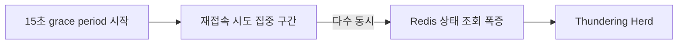
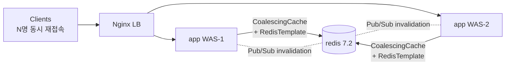
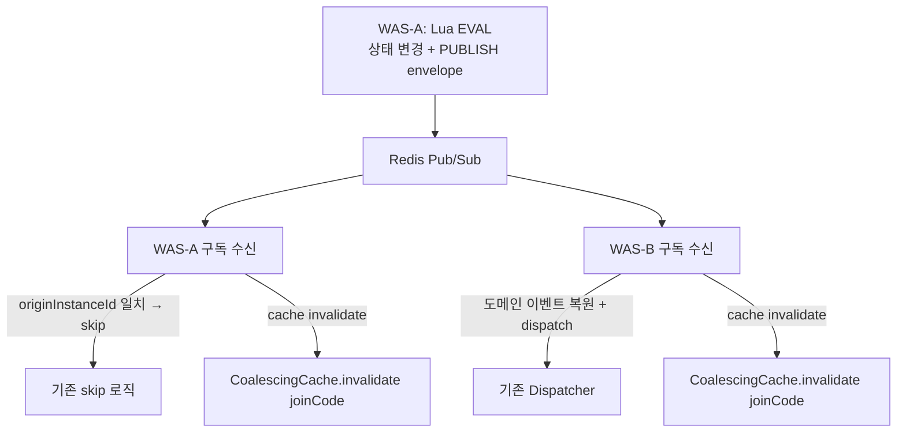
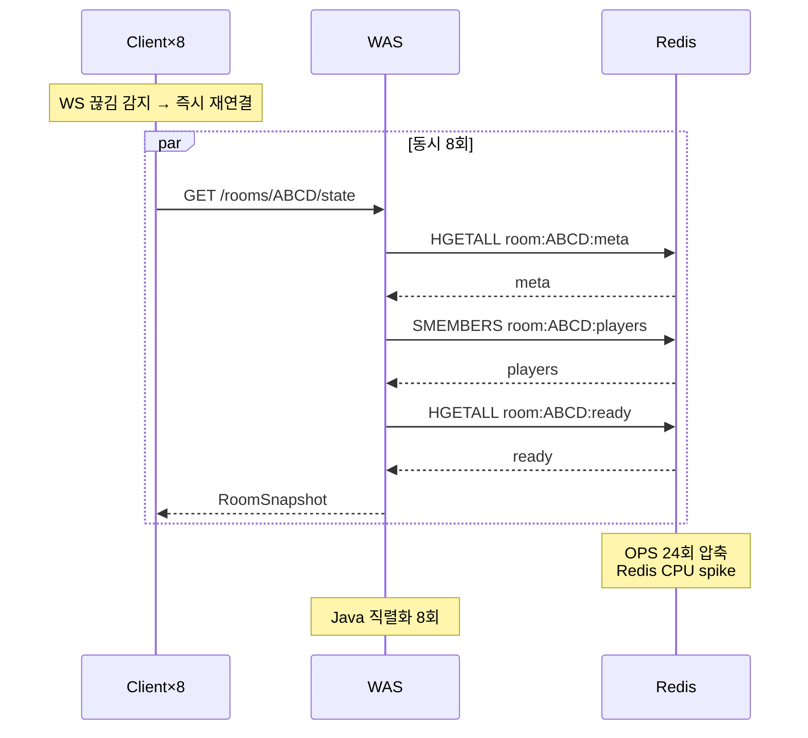
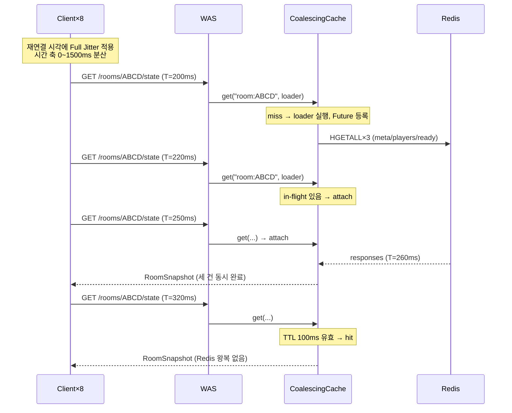

# 실험 설계 Sprint 4: 재접속 Thundering Herd → Jitter + Request Coalescing

> **현재 상태 메모 (2026-04-29)**: 이 문서는 Sprint 4 초기 설계안이다. 실제 구현은 클라이언트 재접속 REST 조회 전체가 아니라, `roomVersion` 기반 서버 Pub/Sub gap recovery에서 Redis snapshot read가 몰리는 문제를 먼저 다뤘다. 구현 결과는 `_workspace/sprint_4/02_implementation_report.md`, 측정 계획은 `_workspace/sprint_4/03_metric_capture_plan.md`를 기준으로 본다.

> **전제**: 본 설계는 Sprint 3 (Redis SSOT + Pub/Sub + Lua) 가 구현 완료된 세계를 가정한다. 방 상태/세션 매핑은 Redis에 있고, WAS 간 이벤트는 `coffeeshout:events` 채널로 전파된다. Sprint 3는 현재 설계 문서 단계이며 실제 구현은 별도 진행 예정. Sprint 4 설계는 Sprint 3 결과물 위에서 동작한다.

---

## 1. 문제 정의

### 1.1 Thundering Herd 란

단일 장애/배포/네트워크 단절 직후, 끊어졌던 다수의 클라이언트가 **거의 동시에** 재접속·상태 조회를 시도하는 현상. 정상 상황에서 시간 축에 분산되어 있던 요청이 **수 초 창에 압축**되면서 Redis/WAS 자원을 순간적으로 고갈시킨다.

### 1.2 Sprint 3 가정 위에서 재정의

Sprint 3으로 방 상태는 Redis SSOT에 올라와 있다. 재접속한 클라이언트의 정답은 "Redis를 한 번 읽으면 끝"이다. 문제는 "읽어야 하는 클라이언트가 동시에 너무 많다"는 것.

| 차원 | baseline (Sprint 3 이전) | Sprint 3 완료 | Sprint 4 타깃 |
|---|---|---|---|
| 상태 읽기 경로 | WAS 메모리 (로컬 HashMap) | Redis `HGETALL` / `SMEMBERS` | 동일 — 단 동시 요청을 묶음 |
| 실패 모드 | split-brain (데이터 문제) | Redis OPS 폭증 (부하 문제) | 평탄화 |
| 해결 난이도 | 구조 재설계 | 패턴 추가 | 패턴 추가 |

### 1.3 발생 메커니즘 (단계별)

1. 트리거 (WAS 재시작, 네트워크 hiccup, 모바일 포그라운드 복귀 등)으로 WebSocket 세션 수십~수백 개가 동시에 끊김
2. 클라이언트 SDK가 끊김을 감지, **즉시** 재연결 시도
3. 재연결 직후 각 클라이언트가 "내 방 상태가 어떻게 됐지?"를 폴링/REST 조회 (`GET /rooms/{joinCode}/state` 류)
4. 같은 방의 8명이 동시에 같은 상태 요청 → Redis `HGETALL` 8회 + Java 직렬화 8회
5. 수십 개 방이 동시 영향이면 Redis OPS·WAS CPU 스파이크 → latency 증가 → timeout → 더 많은 재시도 (악순환)

### 1.4 정상 상황과 비교

| 지표 | 정상 | Thundering Herd |
|---|---|---|
| Redis OPS (같은 엔드포인트) | 평탄, 평균 근방 | 수 초 안에 수십~수백 배 압축 |
| WAS CPU | 평탄 | spike 후 회복 |
| p95 latency | 안정 | 재접속 후 수 초간 급등 |
| 클라이언트 재시도 | 거의 없음 | 실패 → 재시도 폭증 |

---

## 2. Motivation — 이 프로젝트가 겪을 가능성

일반론이 아니라 코드·과거 이력 증거로 본 이 프로젝트 고유의 리스크.

### 실증 A — Winner 공유 패턴 (insights #4)
커밋 `6d2e6f6`에서 룰렛 결과를 "한 WAS에서 계산 → Pub/Sub 방송" 구조로 바꾼 적이 있다. 재접속한 클라이언트가 "결과가 뭐였더라?"를 서버에 다시 물어보는 순간, 방 크기(최대 6명)만큼 동시 조회가 들어온다. Sprint 3 SSOT 위에서도 **읽기 쿼리 압축**은 그대로 남는다.

### 실증 B — RoomEventWaitManager 잔상 (insights #6)
커밋 `03850e5`의 "간헐적 방 참가 실패" 원인은 "비동기 처리 완료를 기다리는 수단이 없었다". 대응으로 `CompletableFuture` 기반 `RoomEventWaitManager`를 도입했다가 단일 WAS로 돌아가면서 제거됐다. **이 프로젝트 팀은 이미 동시 요청을 `CompletableFuture`로 묶는 발상에 익숙하다** — Request Coalescing 구현 친화적.

### 실증 C — DelayedPlayerRemovalService 15초 grace period (insights #8)
`DelayedPlayerRemovalService`는 Disconnect 후 15초를 기다린다. 모바일 앱 전환·짧은 네트워크 단절을 흡수하기 위한 장치. **바로 이 15초 안에 재연결이 몰려 들어온다**. grace period 설계 자체가 Thundering Herd 발생 조건을 내포한다.



### 실증 D — 100ms 레이싱 tick
Sprint 3 설계의 `room:{joinCode}:positions`는 100ms 주기 갱신. 재접속한 플레이어가 "현재 위치 어디?"를 물으면 게임 진행 중인 방마다 매 100ms 주기와 별도로 순간 read 부하가 추가된다.

---

## 3. 인프라 토폴로지

### Sprint 3 대비 변경점

**없음**. WAS 수, Redis 구성, Nginx LB, docker-compose 서비스 구성 모두 Sprint 3 결과를 그대로 계승한다. 본 스프린트는 **코드 레벨 패턴(Jitter · Coalescing) 도입**이다.



- Jitter는 클라이언트 책임 (SockJS/STOMP 재연결 옵션). 서버는 가이드만 docs/client/에 제공.
- Coalescing은 WAS 내부 메모리 레벨 (JVM heap). Redis 쪽 변경 없음.

### Sprint 3과 충돌 지점

| Sprint 3 가정 | Sprint 4 추가 | 충돌 여부 |
|---|---|---|
| 이벤트는 Redis 읽으라는 신호, 상태는 Redis | Coalescing이 짧게 (50~200ms) 값을 캐시 | **약한 충돌** — invalidation 설계 필수 |
| Pub/Sub fire-and-forget | invalidation 유실 시 cache stale | Sprint 5에서 seq로 해결 예정 |
| `originInstanceId` 필터 | 자기 invalidation도 정상 수신 | 충돌 없음 |

---

## 4. Jitter 설계

### 4.1 Jitter 란 — 한 줄 정의

"재연결·재시도 시각에 무작위 오프셋을 섞어 시간 축에서 요청을 분산시키는 기법".

### 4.2 책임 위치

| 위치 | 장점 | 단점 |
|---|---|---|
| **클라이언트 (★)** | 실제 네트워크 진입 전에 분산 → 서버가 아예 받지 않음 | 클라이언트 구현 일관성 필요 |
| 서버 (토큰 버킷, 429) | 클라이언트 신뢰 불필요 | 이미 서버가 요청을 받은 후 — 연결 자체 부하는 못 막음 |

추천: **클라이언트 단독**. 서버측 backpressure는 Sprint 9 배포 시나리오에서 재검토.

### 4.3 Backoff 공식

$$\text{delay}_n = \min(\text{cap}, \text{base} \cdot 2^n) \cdot (0.5 + \text{random}() \cdot 0.5)$$

| 파라미터 | 추천값 | 근거 |
|---|---|---|
| base | 500ms | WS 재연결 기본 interval과 정합 |
| cap | 15s | `DelayedPlayerRemovalService` grace period 상한 |
| n | 재시도 횟수 | 0부터 시작 |
| random() | `[0, 1)` uniform | Full Jitter (AWS 아키텍처 블로그 관용 공식) |

계수 `0.5 + random*0.5`은 **Equal Jitter** 변형: 하한(base*2^n/2)은 보장하면서 상한에 랜덤성을 둔다. 순수 Full Jitter(`random * base * 2^n`)도 가능하나, 첫 재시도가 즉시 나가는 케이스를 피하기 위해 하한 보장을 선호.

### 4.4 서버가 제공할 가이드 산출물

- `docs/client/reconnect-guidelines.md` — SockJS/STOMP `reconnectDelay`, exponential backoff 옵션, 공식 예시
- 본 스프린트에서 **백엔드 코드 변경 없음** (Jitter 부분)
- 프론트엔드 구현은 다른 레포/다른 담당자 책임 → 가이드 문서만 산출

---

## 5. Request Coalescing 설계

### 5.1 패턴 정의

같은 키(여기서는 `joinCode` 또는 `joinCode:resource`)에 대한 **동시 in-flight** 요청이 여러 건 도착하면, 첫 요청만 실제 Redis 조회를 수행하고 나머지는 첫 요청의 결과를 공유한다.

```
T=0ms   req1 도착 → in-flight 없음 → Redis 조회 시작, Future 등록
T=3ms   req2 도착 → in-flight 있음 → Future에 attach
T=5ms   req3 도착 → in-flight 있음 → Future에 attach
T=8ms   Redis 응답 → Future complete → req1/2/3 모두 같은 결과 수신
T=8ms   (옵션) cache entry에 TTL 부여
T=50ms  req4 도착 → cache hit (TTL 안) → 즉시 반환
T=200ms req5 도착 → cache 만료 → 새 in-flight 시작
```

### 5.2 인터페이스 추상 — `CoalescingCache<K,V>`

```
interface CoalescingCache<K, V> {
    // 같은 키 동시 호출은 loader를 1회만 실행
    V get(K key, Supplier<V> loader);

    // Pub/Sub 수신 등 외부 신호로 즉시 무효화
    void invalidate(K key);

    // 관측용
    CoalescingStats stats();
}

record CoalescingStats(
    long hits,           // cache hit
    long misses,         // loader 실행
    long coalesced,      // in-flight에 묶인 요청 수
    long invalidations
) {}
```

- 구현체는 developer 단계. 일반적으로 `ConcurrentHashMap<K, CompletableFuture<V>>` + TTL 기반.
- `Caffeine`의 `AsyncLoadingCache`도 후보 (동일 semantics 기본 제공).

### 5.3 적용 범위

| 대상 | 적용 여부 | 근거 |
|---|---|---|
| `GET /rooms/{joinCode}/state` 류 방 상태 조회 | **★ 적용** | 재접속 시 가장 몰리는 엔드포인트 |
| 플레이어 목록 / Ready 맵 | 방 상태 조회에 포함 | 방 상태와 같은 키로 묶음 |
| MiniGame 진행 상태 | 적용 | 100ms tick 재조회 시 압축 효과 큼 |
| 쓰기 작업 (enter, ready toggle) | 미적용 | Coalescing은 read 전용 |
| Pub/Sub 수신 처리 | 미적용 | 이벤트는 묶지 않음 |
| MenuRepository (메뉴 조회) | 본 스프린트 범위 밖 | Sprint 3에서 범위 제외된 영역 |

추천 키 체계:

| 키 | 값 타입 | 로더 |
|---|---|---|
| `room:{joinCode}` | `RoomSnapshot` record | Redis `HGETALL`×N 조합 → Room 재조립 |
| `minigame:{joinCode}` | `MiniGameSnapshot` | `positions` Hash `HGETALL` |

### 5.4 TTL 정책

| 옵션 | TTL | 특성 |
|---|---|---|
| 캐시 없이 in-flight만 | 0ms | 폭증 순간에만 묶음. 가장 안전(stale 없음), 효과 제한적 |
| **★ 짧은 캐시** | 100ms | 100ms 동안 follow-up 흡수. 사용자 체감 무시 가능 |
| 긴 캐시 | 1s+ | stale 위험 커짐. Pub/Sub invalidation 필수 |

100ms 기준: 재접속 Herd 폭증은 보통 1~3초 창. 100ms cache만으로도 10~30회 흡수 가능.

### 5.5 Cache Invalidation 전략



규칙:
- Pub/Sub envelope 수신 시 `joinCode` 단위로 cache 무효화 ( `RoomSnapshot` / `MiniGameSnapshot` 모두)
- 자기 메시지(`originInstanceId` 일치)도 **invalidation은 수행** — 쓰기 WAS도 자기 캐시가 stale이 됨
- TTL(100ms)은 fallback — invalidation 누락 시 최대 stale window

### 5.6 실패 처리

| 상황 | 동작 |
|---|---|
| loader 실행 중 Redis timeout | Future exceptionally complete → attach된 모든 요청에 같은 예외 전파 |
| 공유 실패 후 즉시 재시도 | 각 호출자가 retry 책임. 첫 호출자 실패로 follow-up이 차단되지 않도록 Future 완료 시 cache entry 즉시 제거 (TTL 무관) |
| loader 무한 대기 | loader 자체에 타임아웃 (예: 500ms). Sprint 5에서 Redis 장애 시나리오와 연동 |

---

## 6. 시퀀스 다이어그램

### 6.1 Before — 8명 동시 재접속



### 6.2 After — Jitter + Coalescing



결과:
- Redis OPS: 24회 → 3회 (첫 miss만 실행)
- Java 직렬화: 8회 → 1회 (공유)
- 시간 분산으로 나머지 요청도 다른 방과 겹치지 않음

---

## 7. 재현·검증 시나리오

### 7.1 재현 도구 — artillery 신규 시나리오

**신규 파일** (명세만, 구현은 developer): `load-test/scenarios/reconnect-storm.yml`

phases:
1. **warmup** 30s — 방 N개 생성, 각 방에 8명 입장, 정상 트래픽
2. **storm trigger** — WAS 컨테이너 중 1대 `docker compose restart`, 또는 artillery `engine.ws` 강제 close
3. **reconnect burst** 10s — 모든 클라이언트 즉시 재연결 + `/state` 조회 × 3회 (폴링)
4. **observe** 60s — 재접속 안정화, 재시도 여부 관찰

옵션: `reconnect-storm-with-jitter.yml` (Full Jitter 적용 버전, 비교용)

### 7.2 측정 지표

| 지표 | 도구 | baseline 기대 | after 기대 |
|---|---|---|---|
| Redis OPS peak | `redis-cli INFO stats` `instantaneous_ops_per_sec` | burst 순간 > 1000 | burst 순간 < 300 |
| Redis OPS sustained | 같음 | — | — (peak만 관심) |
| REST p95 latency | artillery report | burst 구간 급등 | 평탄 유지 |
| WAS CPU | `docker stats` | spike | 완만 |
| `CoalescingCache.stats()` | 애플리케이션 로그 | — | `coalesced / misses ≥ 5` |
| 클라이언트 재시도 수 | artillery custom metric | 증가 | 근접 0 |

### 7.3 성공/실패 판정

**성공 조건 (AND)**:
- Redis OPS peak가 baseline 대비 ≥ 60% 감소
- REST p95 latency가 burst 구간에도 정상 구간 대비 2배 이내
- `coalesced / misses` 비율이 방 인원수의 1/2 이상 (8명 방이면 평균 4건 묶임)
- 회귀: 기존 단일 WAS 시나리오 회귀 0 실패

**실패 조건**:
- stale 응답 관측 (invalidation 누락으로 구 상태 반환) — Sprint 5로 이관
- 첫 요청 실패 시 follow-up까지 실패 확산 — 재시도 정책 재설계

### 7.4 재현 최소 절차

```
# 1. Sprint 3 상태 확인
docker compose up -d mysql redis app-1 app-2  # (Sprint 3 완료 전제)

# 2. 회귀 테스트
./gradlew test

# 3. artillery 부하
artillery run load-test/scenarios/reconnect-storm.yml --output baseline.json
# (Coalescing 활성 상태)
artillery run load-test/scenarios/reconnect-storm.yml --output after.json

# 4. WAS 재시작 재현 (선택)
docker compose restart app-1
# 관찰: app-2의 CoalescingCache.stats 로그
```

---

## 8. 트레이드오프

| 트레이드오프 | 완화책 |
|---|---|
| Coalescing wait 중 첫 요청 실패 시 attach된 요청 전부 실패 | loader 완료 즉시 cache entry 제거. 실패 시 즉시 재시도 가능 |
| TTL이 길면 stale, 짧으면 효과 미미 | 100ms + Pub/Sub invalidation 조합 |
| Jitter로 재접속 체감 latency 증가 (즉시가 아님) | grace period 15초 안에서 분산 → 사용자 인지 임계 아래 |
| JVM heap 사용 (in-flight Map) | 방 수 상한(동시 활성 방 N) × 키 크기 — 수 KB 단위 |
| Pub/Sub 유실 시 invalidation 누락 | Sprint 5에서 seq 기반 유실 감지로 해결 |
| WAS-로컬 캐시 → WAS마다 stale window 독립 | 수용. 글로벌 캐시는 오히려 Redis 왕복 비용 도입 |

---

## 9. Sprint 5와 연결

- **envelope 유실 → invalidation 누락**: Sprint 5에서 envelope에 `seq` 필드 추가. 수신 측이 gap 감지 시 해당 `joinCode` cache 강제 invalidate + 풀 스테이트 resync.
- **originInstanceId 재활용**: Sprint 3에서 확보한 필드를 invalidation 로그 상관관계 추적에 활용 가능.
- **Coalescing TTL 동적 조정**: Sprint 5에서 envelope 지연 측정 결과에 따라 TTL을 런타임에 조정하는 옵션 검토.

---

## 10. 검증 계획

### 기능 기준 (필수)

| 검증 | 방법 | 통과 기준 |
|---|---|---|
| 기존 회귀 | `./gradlew test` | 0 실패 |
| Coalescing 단위 테스트 | In-memory stub loader | 동시 100 호출 → loader 1회 실행, 100 동일 결과 |
| Invalidation 단위 테스트 | Pub/Sub mock | envelope 수신 → 해당 키 entry 제거, 다음 get에서 loader 재실행 |
| 실패 전파 | loader throw | attach된 모두 same exception, 다음 get에서 재시도 가능 |

### 성능 기준 (관찰)

| 측정 | baseline | 타깃 |
|---|---|---|
| Redis OPS peak (burst) | 관측치 | ≥ 60% 감소 |
| REST p95 (burst 구간) | 관측치 | 정상 대비 ≤ 2배 |
| `CoalescingCache.stats().coalesced` | — | 의미 있는 비율 (> misses × 평균 동시성) |

### Sprint 3과의 통합

Sprint 3 검증 시나리오(`multi-was-fanout.yml`)가 그대로 통과해야 한다. Coalescing 도입이 멀티-WAS SSOT 경로를 깨뜨리지 않음을 회귀로 보장.

---

## 11. 사용자에게 확인 필요한 결정사항

각 항목에 추천안(★) 표시.

### 11.1 Coalescing 캐시 TTL 기본값
- A. 50ms — 효과 제한적, stale 리스크 최소
- **B. 100ms (★)** — 재접속 Herd 1~3s 창에서 10~30회 흡수
- C. 200ms — 효과 크지만 stale 체감 가능
- D. 캐시 없이 in-flight 묶음만 — stale 없음, 효과 제한적

### 11.2 Jitter 책임 위치
- **A. 클라이언트 단독 (★)** — 연결 전 분산, 서버 부담 최소
- B. 서버측 토큰 버킷/429 backpressure 추가 — 클라이언트 신뢰 불필요하지만 연결 자체는 받음
- C. 둘 다 — 방어 이중화, 구현 복잡

### 11.3 Coalescing 적용 범위
- **A. `Room` 상태 조회 + MiniGame 상태 조회 (★)** — 재접속 시 hot path 두 개만
- B. 모든 read 작업 — 과적용. 쓰임 적은 곳은 순수 오버헤드
- C. 특정 엔드포인트 선별 (A보다 더 좁게) — 데이터 부족. Phase 1 후 튜닝

### 11.4 Cache Invalidation 트리거
- A. Pub/Sub envelope 수신 시만 — stale 위험 (Pub/Sub 유실 시)
- B. TTL만 — invalidation 지연 (최대 TTL 만큼 stale)
- **C. Pub/Sub + TTL 둘 다 (★)** — invalidation은 즉시 반영, TTL은 안전망

### 11.5 재현 도구
- **A. artillery 신규 시나리오 `reconnect-storm.yml` (★)** — 재현 명시적, 반복 가능
- B. 기존 시나리오 + `docker compose restart` 수동 조합 — 재현성 낮음
- C. k6로 신규 작성 — 기존 스택과 불일치

### 11.6 Coalescing 구현체 선택 (추가 확인)
- **A. 직접 구현 (`ConcurrentHashMap<K, CompletableFuture<V>>` + TTL) (★)** — 의존성 없음, 원리 학습 목적 부합
- B. Caffeine `AsyncLoadingCache` 도입 — 검증된 라이브러리, 의존성 추가
- C. Spring Cache `@Cacheable` + Caffeine — 어노테이션 기반, in-flight 묶음은 별도 설정 필요

---

## 부록 A. 용어 정리

| 용어 | 정의 |
|---|---|
| Thundering Herd | 다수 클라이언트가 동시에 같은 자원을 요청해 부하 폭증 |
| Jitter | 재시도·재연결 시각에 무작위 오프셋을 섞어 분산 |
| Full Jitter / Equal Jitter | AWS 아키텍처 블로그 관용 분류. Full은 `random*cap`, Equal은 `base/2 + random*base/2` |
| Request Coalescing | 같은 키 동시 요청을 단일 loader 실행으로 묶음 |
| Stale | 캐시가 실제 상태보다 뒤처진 상태 |
| In-flight | 이미 실행 중이나 아직 완료되지 않은 요청 |

---

## 부록 B. 참조

- `_workspace/sprint_3/01_architect_design.md` — SSOT + Pub/Sub + Lua 전제
- `_workspace/insights/01_why_redis_ssot.md` — SSOT 선택 논리
- `_workspace/insights/02_actual_problems_in_project.md` — #4, #6, #8 사례
- `_workspace/sprint_index.md` — 전체 스프린트 매트릭스
- `backend/src/main/java/coffeeshout/global/websocket/DelayedPlayerRemovalService.java` — 15초 grace period
- `backend/src/main/java/coffeeshout/global/websocket/StompSessionManager.java`
- `backend/src/main/java/coffeeshout/global/websocket/PlayerDisconnectionService.java`
- `backend/src/main/java/coffeeshout/global/websocket/event/SessionConnectEventListener.java`
- `backend/src/main/java/coffeeshout/global/websocket/event/SessionDisconnectEventListener.java`
- `backend/src/main/java/coffeeshout/global/websocket/infra/handler/SessionRegisteredEventHandler.java`
