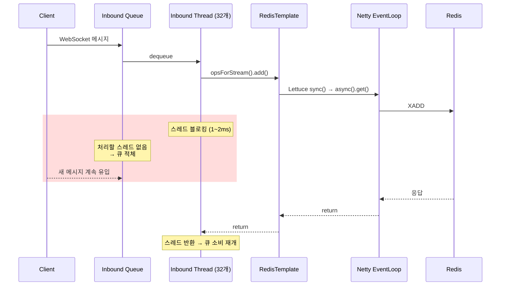
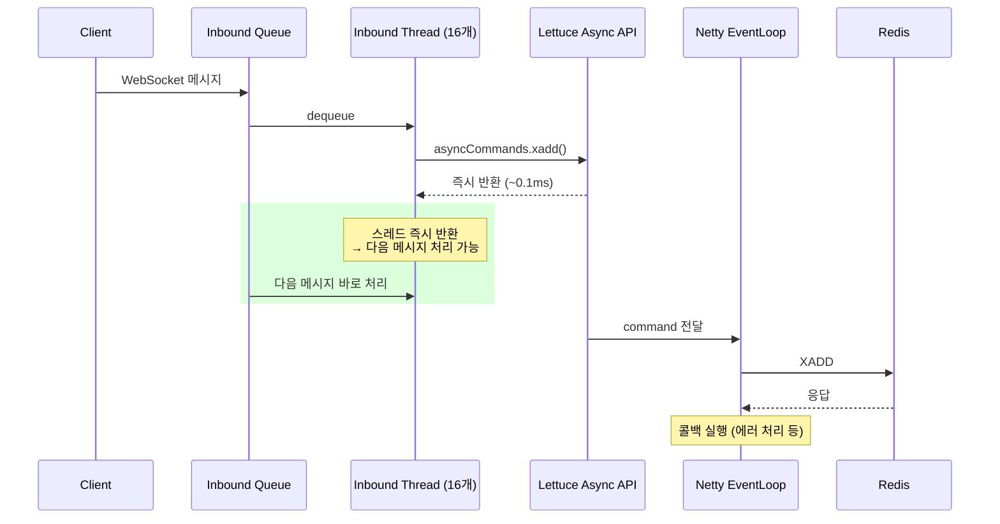

```mermaid
sequenceDiagram
    participant C as Client
    participant Q as Inbound Queue
    participant IT as Inbound Thread (32개)
    participant RT as RedisTemplate
    participant NE as Netty EventLoop
    participant R as Redis

    C->>Q: WebSocket 메시지
    Q->>IT: dequeue
    IT->>RT: opsForStream().add()
    RT->>NE: Lettuce sync() → async().get()
    NE->>R: XADD

    rect rgb(255, 220, 220)
        Note over IT: 스레드 블로킹 (1~2ms)
        Note over Q: 처리할 스레드 없음<br/>→ 큐 적체
        C-->>Q: 새 메시지 계속 유입
    end

    R-->>NE: 응답
    NE-->>RT: return
    RT-->>IT: return
    Note over IT: 스레드 반환 → 큐 소비 재개
```

```mermaid
sequenceDiagram
    participant C as Client
    participant Q as Inbound Queue
    participant IT as Inbound Thread (16개)
    participant AC as Lettuce Async API
    participant NE as Netty EventLoop
    participant R as Redis

    C->>Q: WebSocket 메시지
    Q->>IT: dequeue
    IT->>AC: asyncCommands.xadd()
    AC-->>IT: 즉시 반환 (~0.1ms)

    rect rgb(220, 255, 220)
        Note over IT: 스레드 즉시 반환<br/>→ 다음 메시지 처리 가능
        Q->>IT: 다음 메시지 바로 처리
    end

    AC->>NE: command 전달
    NE->>R: XADD
    R-->>NE: 응답
    Note over NE: 콜백 실행 (에러 처리 등)
```
