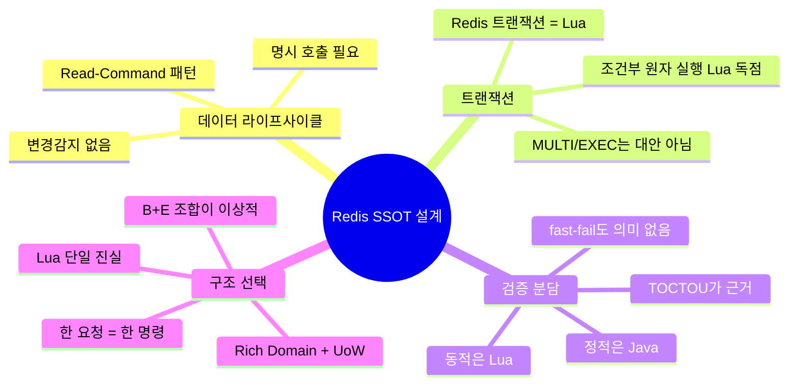

# Coffee-Shout 아키텍처 사고 흐름 — Redis SSOT + Lua 기반 UoW 라이브러리 구상

## Context

Sprint 3에서 Redis SSOT + Pub/Sub + Lua 아키텍처로 전환한 뒤, 도메인 계층과 Redis 계층의 중복/불편함에 대한 토론이 이어졌다. 그 과정에서 "JPA-like 변경감지 → Redis 트랜잭션 → Lua 분담 원칙 → 자작 UoW 라이브러리"까지 사고가 전개됐고, 결국 **Redis 기반 도메인 시스템을 위한 새 라이브러리의 설계 원칙**과 **기존 아키텍처의 구조적 race 이해**로 귀결됐다.

이 문서는 그 사고 흐름을 단계별로 고정하고 다음 액션 아이템으로 연결하기 위한 기록이다.

---

## Phase 1 — 출발점: 변경감지가 필요한가?

### 질문
RedisTemplate으로 세세하게 조정할 때, WAS 메모리 Room 객체와 Redis 상태 간 변경감지가 필요하지 않나?

### 답
필요 없다. 현재 구조는 **Read-Modify-Save가 아니라 Read-Command**다.

| 항목 | JPA (Dirty Checking) | 현재 Redis 설계 |
|---|---|---|
| SSOT | DB | Redis |
| WAS 메모리 객체 | 영속성 컨텍스트(1차 캐시) | 1회용 스냅샷 |
| 변경 감지 | 자동 (flush 시 비교) | 없음 (명시 호출) |
| 반영 방식 | `save()` → dirty field flush | 세분화 메서드 (`addPlayer` 등) |
| 원자성 | DB 트랜잭션 | Lua 스크립트 |

### 핵심 인사이트
- Redis가 SSOT, WAS 메모리는 **스냅샷**에 가까움
- 도메인 메서드(`room.joinGuest()`) 호출이 자동으로 Redis 반영되지 않음
- 각 mutation마다 대응 Repository 메서드(`repo.addPlayer()`)를 개발자가 명시 호출해야 함
- 실수로 빠뜨리면 silent drift

---

## Phase 2 — 중복의 정체

### 관찰
같은 비즈니스 규칙을 **Java와 Lua 두 곳**에 구현 중.

| 규칙 | Java 쪽 | Lua 쪽 |
|---|---|---|
| 정원 초과 금지 | `Room.validateCanJoin()` | `enter_room.lua`: `SCARD` |
| 중복 이름 금지 | `Room.validatePlayerNameNotDuplicate()` | `enter_room.lua`: `SISMEMBER` |
| 플레이어 존재 확인 | `Players.getPlayer()` | `toggle_ready.lua`: `SISMEMBER` |

### 핵심 인사이트
- 로컬 Room은 1회용이라 로컬 검증의 "성공"은 아무 의미가 없음
- Lua가 최종 진실인데 Java 규칙이 함께 있으면 silent drift 발생
- 진짜 문제는 "트랜잭션 없음"이 아니라 **규칙이 두 곳에 쪼개짐**

---

## Phase 3 — Redis 트랜잭션 정체

| 수단 | 원자성 | 격리 | 조건부 분기 | 상태 |
|---|---|---|---|---|
| `MULTI/EXEC` | O (queued) | WATCH로 낙관적 | ✗ | 안 씀 |
| **Lua Script** | **O (싱글 스레드)** | **자동** | **O** | **사용 중** |
| Redisson `RLock` | — (락 기반) | — | O | `@RedisLock`만 |

### 핵심 인사이트
- "Redis에 트랜잭션이 없다"가 틀림. **Lua가 Redis의 트랜잭션 그 자체**
- MULTI/EXEC는 큐잉이라 "값 읽고 조건 판정"이 안 됨 → 비즈니스 규칙 표현 불가
- Lua만이 race-free "조건부 원자 실행" 제공

---

## Phase 4 — 리팩터링 대안 비교

| 대안 | 중복 제거 | 도메인 표현력 | RTT | 위험 |
|---|---|---|---|---|
| A. 현재 유지 | X | 좋음 | 1 | 양측 drift |
| **B. Lua 단일 검증자** | **O** | 보통 (Lua에 규칙) | **1** | Lua 가독성 |
| C. Write-through 이벤트 | O | 좋음 | 1~2 | 복잡도 ↑ |
| D. Active Record | △ | 나쁨 (인프라 침투) | 1 | 테스트 어려움 |
| E. UoW + Flush | O | 좋음 | 1 | 부분 롤백 불가 |

---

## Phase 5 — E번 재평가

### 초기 기각의 오류
"Lua 스크립트 거대화"로 E번을 기각했으나, 실제 Coffee-Shout 컨트롤러 대부분이 **한 요청 = 한 mutation** 패턴이라 거대화는 일어나지 않음.

### E-command 설계
```java
class Room {
    private final List<RedisCommand> pending = new ArrayList<>();

    public void joinGuest(PlayerName name) {
        players.join(Player.createGuest(name));  // 로컬
        pending.add(new EnterRoomCmd(name));     // 명령 축적
    }
}

@RedisTransactional
public void service(JoinCode code, PlayerName name) {
    Room room = repo.find(code);
    room.joinGuest(name);   // 로컬 + 큐
    // 메서드 종료 시 AOP가 pending → Lua로 flush
}
```

### B+E 조합이 베스트
| 조합 | Room 메서드 | 로컬 검증 | 중복 |
|---|---|---|---|
| B 단독 | 삭제 | 없음 | 없음 |
| E 단독 | 유지 + 명령 큐잉 | 유지 (중복) | 있음 |
| **B + E** | **유지 + 명령 큐잉** | **제거** | **없음** |

Rich Domain(`room.joinGuest(name)`) + 검증 단일 소유(Lua) + UoW 자동화 모두 확보.

### 남는 한계
- 여러 mutation + 중간 실패 시 부분 롤백 불가 (Redis 구조적 한계)
- 실무 회피책: **"한 요청 = 한 도메인 연산" 원칙** (현재 아키텍처가 이미 충족)

---

## Phase 6 — Redisson 검토

| 기능 | 평가 |
|---|---|
| `RLock` | 방 단위 락이면 동시 요청 **직렬화** → throughput 급감. Lua 싱글스레드 병렬 수락에 비해 불리 |
| Live Object (`@REntity`) | 필드별 N+1 RTT, 원자성 없음, 도메인 침투. 프로덕션 레퍼런스 드묾 |
| `RTransaction` | MULTI/EXEC 래핑. 조건부 쓰기 불가. Lua보다 약함 |

### 핵심 인사이트
- Redisson은 Lua의 대체재가 아니라 **다른 카테고리**
- 현재 `RedisLockAspect`에서 멱등성 키 용도로 국한 사용 중이 적정
- UoW 리팩터링을 Redisson으로 해결할 이유 없음

---

## Phase 7 — 자작 라이브러리 구상

### 사용자가 제안한 4단계
1. Entity 필드 변경 메서드에 어노테이션으로 저장 전략 선언
2. 트랜잭션 안에서 변경 메서드 호출 기록
3. 트랜잭션 종료 시 Lua로 일괄 실행
4. 실패 시 기존 데이터로 롤백

### 구현 난이도
| 단계 | 난이도 | 비고 |
|---|---|---|
| 1. 어노테이션 | 하 | `@interface RedisCommand` |
| 2. 트랜잭션 스코프 기록 | 중 | AOP + ThreadLocal |
| 3. Lua 일괄 실행 | 하 | `TransactionSynchronization.afterCommit()` |
| **4. 롤백** | **상** | **Redis 구조적 한계로 완벽 구현 불가** |

### 롤백이 왜 어려운가
- JPA는 DB 트랜잭션 롤백을 공짜로 제공. Redis는 없음
- 보상 트랜잭션 직접 구현해야 하고, 그 보상도 실패 가능
- Pub/Sub이 **비가역** — 이미 발행된 이벤트는 취소 불가

### 스코프 축소 (현실적 MVP)
- "한 트랜잭션 = 한 @RedisCommand" 원칙 강제
- 롤백 고민 제거
- 1~3번만 구현

---

## Phase 8 — 시장 포지션

### 기존 경쟁자 분석
| 라이브러리 | 포지션 | 한계 |
|---|---|---|
| Redisson Live Objects | JPA-like, 필드 자동 동기화 | N+1 RTT, 원자성 없음, 도메인 침투 |
| Redis OM Spring | `@Document` + Repository | RediSearch 바인딩, 무거움 |
| Spring Data Redis (`@RedisHash`) | 단순 CRUD | 원자성 없음, mainstream 아님 |
| Redisson RTransaction | MULTI/EXEC 래핑 | Lua의 약한 버전 |

### 빈 포지션
**"도메인 연산 ↔ Lua 스크립트 선언적 매핑 + 트랜잭션 경계 UoW"** — 비어있음.

### 카테고리 분류
```
A. 캐시 (DB primary)        → Spring Cache + @Cacheable
B. 분산 자료구조·락          → Redisson
C. Redis SSOT + 단순 CRUD   → @RedisHash (거의 안 쓰임)
D. Redis SSOT + 도메인 연산  → 라이브러리 없음 (수동 구현)
   + race-free 원자성         ← 타겟 영역
```

### 가치 평가
- Production 채택은 어렵지만 **OSS 커리어 + 포트폴리오** 가치 높음
- Coffee-Shout를 **reference app**으로 활용 가능 (실제 multi-WAS race 사례)
- Spring 한국 커뮤니티에 "Redis 진지한 1인 OSS" 희소

---

## Phase 9 — Spring Data Redis 실체

### `@RedisHash` 동작
```
save(Room)
  → DEL "Room:ABCD"        (기존 키 전체 삭제)
  → HMSET "Room:ABCD" {...}  (전체 필드 재덤프)
  → @Indexed 보조 인덱스 갱신
```

### 핵심 인사이트
- Dirty checking **없음**. 매번 full dump
- DEL → HMSET 사이 **원자성 깨짐** (잠깐 키 없는 순간)
- Collection은 `field.[index]` flat 키로 분해 (어색)
- `PartialUpdate` API 존재하지만 수동 경로 지정이라 안 쓰임

### 왜 mainstream 못 됐나
- JPA 흉내 냈지만 N+1 RTT + 원자성 없음 + 도메인 침투 삼중고
- "Redis를 primary store로 쓴다" 전제인데 실무에선 대부분 캐시 용도

---

## Phase 10 — Cache-aside 관행

### 업계 분포
| 저장 방식 | 비중 | 비고 |
|---|---|---|
| **JSON blob (`@Cacheable` 기본)** | **80%+** | Jackson + `@class` typing |
| Hash 수동 분해 | 소수 | 카운터 등 atomic 필요 시 |
| MessagePack/Protobuf | 극소수 | 극단 최적화 |
| `@RedisHash` + CrudRepository | 거의 없음 | — |

### 추상 필드/다형성 처리
```json
{
  "@class": "com.x.Order",
  "payment": { "@class": "com.x.CreditCard", ... },
  "items": [ { "@class": "com.x.PhysicalItem", ... } ]
}
```
Jackson default typing으로 FQCN 박기 — 업계 표준 트릭.

### 핵심 인사이트
- Hash 쪼개기는 "Redis SSOT" 영역에서만. Cache-aside에선 JSON blob이 적정
- 사용자 라이브러리 타겟은 **D 영역 (Redis SSOT + 도메인 연산)** — 겹치지 않음

---

## Phase 11 — Lua vs Java 분담 원칙

### 질문
Redis에 트랜잭션 없으니 비즈니스 로직이 어쩔 수 없이 Lua에 들어가야 하나?

### 답
**"race-free 원자성이 필요한 좁은 구간만 Lua"**. 나머지 비즈니스는 Java.

### 분담 기준

| 검증 유형 | 위치 | 예시 |
|---|---|---|
| **정적** (입력 자체 규칙) | Java | 좌표 범위, 이름 길이, null, 타입 |
| **동적** (다른 주체 상태 의존) | Lua | 충돌, 정원, 중복 이름, 상태 전이 |
| **복합 (계산 + 정적)** | Java | 룰렛 당첨자 결정, 점수 계산 |
| **복합 (계산 + 동적)** | 분리 | Java 계산 → Lua atomic 반영 |

### Coffee-Shout 현 Lua 검증
| 스크립트 | 줄 수 | 성격 |
|---|---|---|
| `claim_joincode.lua` | ~5 | SETNX |
| `enter_room.lua` | ~15 | 정원/중복 체크 + SADD + PUBLISH |
| `toggle_ready.lua` | ~10 | 존재 체크 + HSET + PUBLISH |
| `remove_player.lua` | ~10 | SREM + HDEL x3 + PUBLISH |
| `update_positions.lua` | ~15 | HSET batch + EXPIRE + PUBLISH |

전부 **20줄 이내**. 룰렛 당첨자·미니게임 점수 같은 본문은 Java. 이 분배가 이상적.

### Lua 공포 완화 패턴
1. **ARGV로 규칙 파라미터 밀어내기**: Java가 `max`, `required_state` 넘기고 Lua는 체크만
2. **반환 코드만 숫자**, 의미 번역은 Java의 switch로
3. **계산은 Java에서 미리**, Lua는 결과 대입만
4. **20줄 초과 시 설계 경고 신호**

---

## Phase 12 — TOCTOU: 동적 검증은 Java에서 하면 안 됨

### 통찰
플레이어 A와 B가 맵에서 충돌 금지 규칙. Java에서 "빈 칸인가?" 체크하는 건 **의미 없음**.

```
T1: Java 로컬 체크 → "(2,3) 비었음" 판정 → OK
    ↓ (다른 WAS가 그 칸 점유)
T2: Redis 저장 → 실제로는 충돌 상태
```

**TOCTOU (Time of Check to Time of Use)** — 검증 시점과 저장 시점 사이에 상태가 바뀌면 검증 결과가 보장되지 않음. 동적 규칙의 근본 한계.

### fast-fail 가치도 없음
- 로컬 통과 = 최종 성공 보장 X
- 로컬 실패 = 최종 실패 확정도 아님 (stale 데이터면 false negative)
- 동적 규칙은 로컬 결과를 **신뢰할 근거 자체가 없음**

### Coffee-Shout `Room.joinGuest` 로컬 검증 재평가
```java
validateRoomReady();              // 동적 → TOCTOU 발생 가능
validateCanJoin();                // 동적 → 완전히 의미 없음
validatePlayerNameNotDuplicate(); // 동적 → 완전히 의미 없음
```
**전부 제거 가능**. Lua가 최종 진실. 제거하면 규칙 단일 소유 달성.

### 라이브러리 설계 함의
`@LuaCommand` 메서드 본문에 **동적 검증 넣지 말 것** — 문서 규약에 명시.

---

## Phase 13 — Stream 아키텍처의 구조적 race

### 과거 Stream 기반이었다면 깨졌을 시나리오
```
T0: A 레디 상태
T1: A → "레디 해제" → XADD room stream (Consumer 처리 전)
T2: host → "게임 시작" → XADD room stream
T3: ConsumerThread-1 T2 먼저 집음
    → isAllReady() 검증: 메모리상 A 레디 → 통과 → 게임 시작 ❌
T4: ConsumerThread-2 T1 처리 → 이미 시작된 게임에 늦은 반영
```

### 구조적 원인
1. **Command 발행 ≠ 상태 반영** (eventual consistency)
2. **Consumer 병렬화가 순서 깨뜨림** (`concurrent` thread pool)
3. **여러 Stream 간 순서 무보장**
4. **도메인 검증이 stale snapshot 기반**

### Stream에서 고치는 교과서적 방법
| 방법 | 비용 |
|---|---|
| A. 방 단위 sequential Consumer (액터 모델) | 구현 복잡, 처리량 균일화 어려움 |
| B. Optimistic Concurrency (version 필드) | retry 폭주 가능 |
| C. Command에 precondition + Consumer 재검증 | Consumer가 Lua 역할 |
| D. Event Sourcing + Projection | 과도한 복잡도 |

### Lua + Pub/Sub 전환의 근본 가치
- Write의 **검증과 반영을 같은 원자 단위**로 묶음 → TOCTOU 제거
- Consumer 없음 → 처리 지연 없음
- Redis 싱글 스레드가 자동 직렬화 → 순서 문제 사라짐
- Pub/Sub은 알림 전용 → 유실돼도 Redis SSOT이 진실

### 당시 Stream이 드러나지 않았던 이유
- Sprint 1-2 single WAS + Stream은 **순차 Consumer로 race 가려짐**
- Multi-WAS + 병렬 Consumer로 확장하는 순간 노출
- Sprint 3 전환이 시의적절

---

## 종합: 지금까지 얻은 4가지 축



---

## 다음 액션 아이템

### 단기 — Coffee-Shout 코드 정리

1. **Room의 로컬 동적 검증 제거**
   - `validateRoomReady()`, `validateCanJoin()`, `validatePlayerNameNotDuplicate()` 삭제
   - Lua 반환 코드에만 의존

2. **`enter_room.lua`에 READY 상태 검증 추가** (현재 누락)
   - 반환 코드 `-4` 추가 및 예외 매핑

3. **`save(room)` 사용처 최소화**
   - 최초 생성(`saveIfAbsentRoom`)만 전체 save
   - 나머지는 세분화 메서드로

### 중기 — B+E 조합 실험

1. **Room에 `List<RedisCommand> pending` 필드 도입**
2. **도메인 mutation 메서드가 pending 큐잉**
3. **`repo.flush(room)` 또는 `@RedisTransactional` AOP로 일괄 실행**
4. **RoomCommandService를 "얇은 orchestration"으로 축소**

### 장기 — 자작 라이브러리 추출

1. **스코프**: 단일 명령 UoW (롤백 없음)
2. **위치**: Coffee-Shout 내부 패키지로 시작 → 검증 후 Gradle 서브프로젝트 → 필요 시 별도 repo
3. **reference app**: Coffee-Shout 본체
4. **문서 규약**: "@LuaCommand 본문에 동적 검증 금지, Lua 20줄 이내 유지"
5. **블로그/발표 소재**: 위의 Phase 1~13 사고 흐름 자체가 시리즈 글감

---

## 검증

- Phase 11~13은 **구조적 이해**라서 코드 변경 없이도 완결
- 단기 액션 아이템은 `./gradlew test` + Testcontainers 기반 `LuaAtomicityConcurrencyTest`로 회귀 검증 가능
- 중기 B+E 조합은 Sprint 4 이후로 예약 (Sprint 3 안정화 우선)
- 라이브러리 추출은 Coffee-Shout 본체 안정화 + B+E 패턴 검증 완료 후 진행
